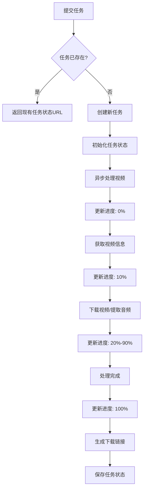
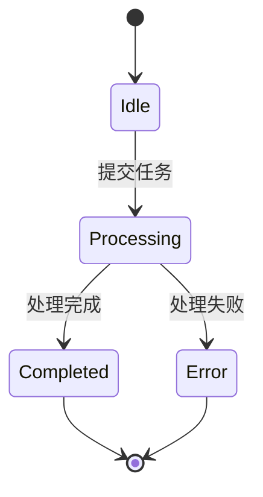

# API参考

<cite>
**本文档中引用的文件**  
- [main.py](file://api/main.py)
- [video_processor.py](file://api/video_processor.py)
</cite>

## 目录
1. [简介](#简介)
2. [POST /api/process - 处理视频链接](#post-apiprocess---处理视频链接)
3. [GET /api/status/{task_id} - 查询任务状态](#get-apistatustask_id---查询任务状态)
4. [GET /api/download/{file_id} - 下载文件](#get-apidownloadfile_id---下载文件)
5. [GET /api/health - 健康检查](#get-apihealth---健康检查)
6. [异步处理与轮询最佳实践](#异步处理与轮询最佳实践)

## 简介
视频下载API提供了一套完整的RESTful接口，用于异步处理视频下载和音频提取任务。该服务支持从YouTube、Bilibili、TikTok等30多个平台下载视频并提取音频，采用FastAPI构建，具备高性能和高可靠性。API遵循标准的三步流程：提交任务 → 查询状态 → 下载文件。

## POST /api/process - 处理视频链接

该接口用于提交视频处理任务，支持同时下载视频和提取音频。

### 基本信息
- **HTTP方法**: POST
- **URL路径**: `/api/process`
- **请求头要求**: `Content-Type: application/json`

### 请求体结构
请求体应为JSON格式，符合 `ProcessVideoRequest` 模型：

| 字段名 | 类型 | 是否必需 | 默认值 | 说明 |
|--------|------|----------|--------|------|
| url | string | 是 | 无 | 视频链接URL |
| extract_audio | boolean | 否 | true | 是否提取音频 |
| keep_video | boolean | 否 | true | 是否保留视频文件 |

### 请求示例
```json
{
  "url": "https://www.youtube.com/watch?v=dQw4w9WgXcQ",
  "extract_audio": true,
  "keep_video": true
}
```

### 成功响应
- **状态码**: 200 OK
- **响应模型**: `ProcessVideoResponse`

| 字段名 | 类型 | 说明 |
|--------|------|------|
| task_id | string | 任务唯一标识符（UUID） |
| message | string | 任务状态描述信息 |
| status_url | string | 查询任务状态的URL |

**响应示例：**
```json
{
  "task_id": "a1b2c3d4-e5f6-7890-g1h2-i3j4k5l6m7n8",
  "message": "任务已创建，正在处理中...",
  "status_url": "/api/status/a1b2c3d4-e5f6-7890-g1h2-i3j4k5l6m7n8"
}
```

### 错误响应
- **400 Bad Request**: 请求参数无效
- **500 Internal Server Error**: 服务器处理失败

**错误响应示例：**
```json
{
  "detail": "处理失败: 无法获取视频信息"
}
```

### 安全注意事项
- 服务会检查重复的URL处理请求，避免重复下载
- 使用UUID确保任务ID的唯一性
- 支持CORS，允许所有来源访问

**接口来源**
- [main.py](file://api/main.py#L184-L230)

## GET /api/status/{task_id} - 查询任务状态

该接口用于获取指定任务的处理状态。

### 基本信息
- **HTTP方法**: GET
- **URL路径**: `/api/status/{task_id}`
- **路径参数**: `task_id` - 任务唯一标识符

### 响应模型
响应符合 `TaskStatusResponse` 模型：

| 字段名 | 类型 | 说明 |
|--------|------|------|
| task_id | string | 任务ID |
| status | string | 任务状态（processing, completed, error） |
| progress | integer | 处理进度（0-100） |
| message | string | 状态描述信息 |
| created_at | string | 任务创建时间（ISO格式） |
| completed_at | string | 任务完成时间（ISO格式，可选） |
| files | object | 文件类型到下载链接的映射 |
| video_info | object | 视频元信息 |
| error | string | 错误信息（可选） |

### 成功响应
- **状态码**: 200 OK

**响应示例（处理中）：**
```json
{
  "task_id": "a1b2c3d4-e5f6-7890-g1h2-i3j4k5l6m7n8",
  "status": "processing",
  "progress": 60,
  "message": "正在下载视频...",
  "created_at": "2024-01-01T12:00:00",
  "files": {},
  "video_info": {
    "title": "示例视频",
    "duration": 300,
    "uploader": "示例作者"
  }
}
```

**响应示例（已完成）：**
```json
{
  "task_id": "a1b2c3d4-e5f6-7890-g1h2-i3j4k5l6m7n8",
  "status": "completed",
  "progress": 100,
  "message": "处理完成！",
  "created_at": "2024-01-01T12:00:00",
  "completed_at": "2024-01-01T12:05:30",
  "files": {
    "video": "/api/download/video_示例视频_a1b2c3.mp4",
    "audio": "/api/download/audio_示例视频_a1b2c3.mp3"
  },
  "video_info": {
    "title": "示例视频",
    "duration": 300,
    "uploader": "示例作者"
  }
}
```

**响应示例（错误）：**
```json
{
  "task_id": "a1b2c3d4-e5f6-7890-g1h2-i3j4k5l6m7n8",
  "status": "error",
  "progress": 0,
  "message": "处理失败: 无法下载视频",
  "created_at": "2024-01-01T12:00:00",
  "error": "Download failed"
}
```

### 错误响应
- **404 Not Found**: 任务不存在

**接口来源**
- [main.py](file://api/main.py#L320-L345)

## GET /api/download/{file_id} - 下载文件

该接口用于下载处理完成的视频或音频文件。

### 基本信息
- **HTTP方法**: GET
- **URL路径**: `/api/download/{file_id}`
- **路径参数**: `file_id` - 文件ID（文件名）

### 响应格式
- **HTTP状态码**: 200 OK
- **响应类型**: 文件流（FileResponse）
- **Content-Disposition**: attachment，强制下载
- **媒体类型**: 根据文件扩展名自动设置

### 文件类型与媒体类型映射
| 文件扩展名 | 媒体类型 |
|------------|----------|
| .mp4, .avi, .mkv, .mov, .wmv | video/mp4 |
| .mp3, .wav, .m4a, .aac, .flac | audio/mpeg |
| 其他 | application/octet-stream |

### 安全机制
- 防止路径遍历攻击：检查文件名中是否包含 `..`、`/` 或 `\`
- 文件存在性验证：确保请求的文件实际存在
- 中文文件名编码：使用UTF-8编码处理中文文件名

### 成功响应
返回请求的文件流，浏览器将自动下载。

### 错误响应
- **400 Bad Request**: 文件名格式无效
- **404 Not Found**: 文件不存在
- **500 Internal Server Error**: 下载失败

**接口来源**
- [main.py](file://api/main.py#L347-L367)

## GET /api/health - 健康检查

该接口用于检查API服务的健康状态。

### 基本信息
- **HTTP方法**: GET
- **URL路径**: `/api/health`

### 响应模型
| 字段名 | 类型 | 说明 |
|--------|------|------|
| status | string | 服务状态（healthy） |
| timestamp | string | 当前时间戳（ISO格式） |
| services | object | 服务组件状态 |

### 成功响应
- **状态码**: 200 OK

**响应示例：**
```json
{
  "status": "healthy",
  "timestamp": "2024-01-01T12:00:00",
  "services": {
    "video_processor": "available"
  }
}
```

### 用途
- 用于负载均衡器和服务监控
- Docker容器健康检查
- 系统状态监控

**接口来源**
- [main.py](file://api/main.py#L168-L178)

## 异步处理与轮询最佳实践

### 处理流程


**流程来源**
- [main.py](file://api/main.py#L184-L230)
- [main.py](file://api/main.py#L232-L318)

### 轮询最佳实践
1. **初始轮询间隔**: 2-3秒
2. **指数退避**: 处理时间较长时，可适当增加轮询间隔
3. **最大轮询次数**: 建议设置超时机制（如30分钟）
4. **进度监控**: 根据`progress`字段判断处理进度

### 状态转换图


### 错误处理策略
- **网络错误**: 重试机制，建议重试3次
- **服务不可用**: 检查健康状态接口
- **文件不存在**: 确认任务已完成且文件未被清理
- **权限问题**: 确保服务有读写临时目录的权限

### 性能优化建议
- **并发处理**: 服务支持多个任务同时处理
- **资源管理**: 临时文件会定期自动清理
- **缓存机制**: 相同URL的任务会返回现有任务状态
- **智能策略**: 根据平台优化下载参数

**最佳实践来源**
- [main.py](file://api/main.py#L232-L318)
- [video_processor.py](file://api/video_processor.py#L1-L504)