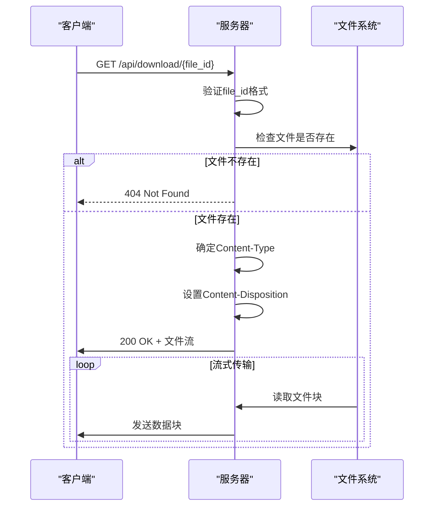

# GET /api/download/{file_id} - 文件下载

<cite>
**Referenced Files in This Document **   
- [main.py](file://api/main.py)
- [file_cleaner.py](file://api/file_cleaner.py)
- [README.md](file://README.md)
</cite>

## 目录
1. [接口概述](#接口概述)
2. [功能说明](#功能说明)
3. [文件ID来源](#文件id来源)
4. [HTTP响应格式](#http响应格式)
5. [临时存储机制](#临时存储机制)
6. [安全机制](#安全机制)
7. [使用示例](#使用示例)
8. [浏览器行为](#浏览器行为)
9. [性能考虑](#性能考虑)

## 接口概述

`GET /api/download/{file_id}` 接口用于通过文件ID下载已处理完成的视频或音频文件。该接口是视频处理流程的最后一步，允许客户端获取由系统处理生成的媒体文件。

此接口设计为简单直接的文件下载端点，采用流式传输方式，确保大文件也能高效传输。接口通过严格的输入验证和安全检查，防止路径遍历等安全风险。

**Section sources**
- [main.py](file://api/main.py#L320-L400)

## 功能说明

该接口的主要功能是提供已处理完成的视频或音频文件的下载服务。当视频处理任务完成后，生成的文件会被存储在临时目录中，客户端可以通过此接口使用文件ID来下载这些文件。

接口工作流程如下：
1. 接收包含文件ID的HTTP GET请求
2. 验证文件ID格式，防止路径遍历攻击
3. 检查文件是否存在
4. 根据文件扩展名确定适当的媒体类型
5. 设置正确的响应头以支持浏览器直接下载
6. 通过流式响应返回文件内容

文件可以是视频文件（如MP4、AVI、MKV等）或音频文件（如MP3、WAV、M4A等），接口会根据文件扩展名自动设置相应的`Content-Type`。

**Section sources**
- [main.py](file://api/main.py#L365-L400)

## 文件ID来源

文件ID来源于`TaskStatusResponse`响应对象中的`files`字段值。当客户端提交视频处理任务后，可以通过`GET /api/status/{task_id}`接口查询任务状态，获取包含文件下载链接的对象。

`TaskStatusResponse`对象的`files`字段是一个字典，映射文件类型到对应的下载链接。例如：

```json
{
  "files": {
    "video": "/api/download/video_视频标题_abc123.mp4",
    "audio": "/api/download/audio_视频标题_abc123.mp3"
  }
}
```

文件ID是完整的文件名，包含前缀（"video_"或"audio_"）、原始视频标题、任务ID的短标识和文件扩展名。客户端需要从下载链接中提取文件名部分作为`file_id`参数。

**Section sources**
- [main.py](file://api/main.py#L86-L95)
- [main.py](file://api/main.py#L320-L367)

## HTTP响应格式

该接口的HTTP响应为文件流，具有以下特征：

- **Content-Type**: 根据文件扩展名动态设置
  - 视频文件（.mp4, .avi, .mkv, .mov, .wmv）: `video/mp4`
  - 音频文件（.mp3, .wav, .m4a, .aac, .flac）: `audio/mpeg`
  - 其他文件: `application/octet-stream`

- **Content-Disposition**: 设置为`attachment`，强制浏览器下载而非内联显示，同时处理中文文件名编码问题

- **响应体**: 文件的二进制数据流

接口通过`FileResponse`类实现流式传输，这意味着文件不会一次性加载到内存中，而是分块传输，这对于大文件下载尤为重要。



**Diagram sources**
- [main.py](file://api/main.py#L365-L400)

**Section sources**
- [main.py](file://api/main.py#L365-L400)

## 临时存储机制

所有处理完成的文件都临时存储在系统的`temp/`目录中，由`file_cleaner`组件管理其生命周期。这种设计避免了永久存储带来的磁盘空间压力，同时确保文件在一定时间内可访问。

`FileCleanerManager`负责定期清理过期文件，其清理策略包括：

1. **时间策略**: 文件保留24小时后自动删除
2. **数量策略**: 保留最近的10个文件，超出部分按时间顺序清理
3. **空间策略**: 当临时目录总大小超过1GB时，清理最老的文件直到满足空间限制

文件清理服务在应用启动时自动启动，并以1小时为间隔定期检查和清理文件。这意味着过期的文件访问会返回404状态码，客户端需要在文件过期前完成下载。

```mermaid
classDiagram
class FileCleanerManager {
+temp_dir : Path
+config : Dict
+is_running : bool
+start_cleanup_service()
+stop_cleanup_service()
+cleanup_files()
+get_storage_info()
}
class FileCleanerConfig {
+enabled : bool
+check_interval : int
+file_retention_hours : int
+max_storage_mb : int
+cleanup_on_startup : bool
+preserve_recent_files : int
}
FileCleanerManager --> FileCleanerConfig : "使用"
FileCleanerManager --> "temp/" : "管理"
```

**Diagram sources**
- [file_cleaner.py](file://api/file_cleaner.py#L0-L198)
- [main.py](file://api/main.py#L54-L54)

**Section sources**
- [file_cleaner.py](file://api/file_cleaner.py#L0-L198)

## 安全机制

该接口实现了多层安全机制，确保文件下载的安全性：

### 路径遍历防护
接口首先验证`file_id`参数，禁止包含`..`、`/`或`\`等字符，有效防止路径遍历攻击：
```python
if '..' in file_id or '/' in file_id or '\\' in file_id:
    raise HTTPException(status_code=400, detail="文件名格式无效")
```

### UUID格式文件ID
文件ID基于任务ID生成，而任务ID使用Python的`uuid`模块生成，确保为标准UUID格式。这使得文件ID不可预测，增加了安全性。

### 临时目录隔离
所有文件存储在专门的`temp/`目录中，与应用代码和其他敏感文件隔离，即使存在漏洞也限制了影响范围。

### 存在性验证
在返回文件前，接口会检查文件是否存在，不存在则返回404，不会暴露文件系统结构。

**Section sources**
- [main.py](file://api/main.py#L320-L400)

## 使用示例

### curl命令示例
```bash
# 下载视频文件
curl -X GET "http://localhost:8000/api/download/video_视频标题_abc123.mp4" -o "video.mp4"

# 下载音频文件
curl -X GET "http://localhost:8000/api/download/audio_视频标题_abc123.mp3" -o "audio.mp3"

# 使用wget下载
wget "http://localhost:8000/api/download/video_视频标题_abc123.mp4" -O "downloaded_video.mp4"
```

### Python requests示例
```python
import requests

# 下载文件
file_id = "video_视频标题_abc123.mp4"
url = f"http://localhost:8000/api/download/{file_id}"

response = requests.get(url, stream=True)

if response.status_code == 200:
    with open("downloaded_file.mp4", "wb") as f:
        for chunk in response.iter_content(chunk_size=8192):
            f.write(chunk)
else:
    print(f"下载失败: {response.status_code}")
```

**Section sources**
- [README.md](file://README.md#L227-L254)
- [test_all_scenarios.py](file://test_all_scenarios.py#L0-L72)

## 浏览器行为

当用户在浏览器中访问此接口时，会发生以下行为：

1. **自动下载**: 由于`Content-Disposition`头设置为`attachment`，浏览器会自动触发文件下载，而不是在页面中显示文件内容。

2. **中文文件名支持**: 接口使用`filename*=UTF-8''`语法正确处理中文文件名，确保下载的文件保留原始中文名称。

3. **下载进度显示**: 浏览器会显示下载进度条，用户可以查看下载状态和剩余时间。

4. **断点续传支持**: 响应包含`Content-Length`头，支持HTTP范围请求，允许浏览器进行断点续传。

5. **安全提示**: 对于某些文件类型，浏览器可能会显示安全警告，提示用户确认是否要下载和打开文件。

**Section sources**
- [main.py](file://api/main.py#L365-L400)

## 性能考虑

该接口在设计时考虑了大文件传输的性能优化：

### 分块传输编码
接口使用流式响应（`FileResponse`），实现分块传输编码（Chunked Transfer Encoding）。这意味着：
- 文件不会一次性加载到内存中
- 服务器可以边读取文件边发送数据
- 内存使用量与文件大小无关，始终保持较低水平
- 支持无限大的文件传输（理论上）

### 流式处理优势
- **内存效率**: 避免大文件导致的内存溢出
- **快速响应**: 客户端可以立即开始接收数据，无需等待整个文件读取完成
- **网络效率**: 数据一旦可用就立即发送，减少延迟

### 大文件建议
对于大文件下载，建议客户端：
- 使用支持断点续传的下载工具
- 确保稳定的网络连接
- 在非高峰时段进行下载以获得更好的速度
- 监控下载进度和错误，实现重试机制

**Section sources**
- [main.py](file://api/main.py#L365-L400)
- [test_all_scenarios.py](file://test_all_scenarios.py#L0-L40)