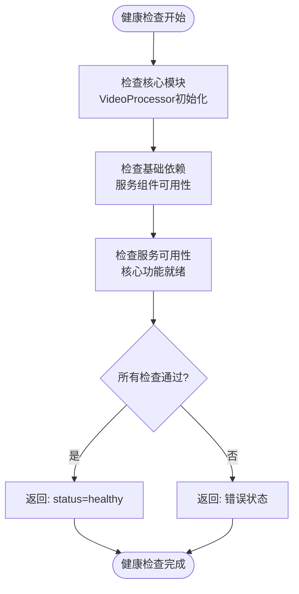

# GET /api/health - 健康检查

<cite>
**引用文件**
- [main.py](file://api/main.py)
- [video_processor.py](file://api/video_processor.py)
</cite>

## 目录
1. [接口概述](#接口概述)
2. [响应格式](#响应格式)
3. [内部检查逻辑](#内部检查逻辑)
4. [请求参数](#请求参数)
5. [认证要求](#认证要求)
6. [性能特性](#性能特性)
7. [Prometheus集成建议](#prometheus集成建议)
8. [健康检查路径配置](#健康检查路径配置)
9. [外部依赖说明](#外部依赖说明)

## 接口概述
GET /api/health 接口用于服务健康状态检查，常用于 Kubernetes 探针或监控系统。该接口通过返回简单的 JSON 响应来指示服务的运行状态，是系统健康监测的重要组成部分。

**Section sources**
- [main.py](file://api/main.py#L160-L168)

## 响应格式
该接口返回一个简单的 JSON 响应，包含服务状态、时间戳和核心服务可用性信息。状态码 200 表示服务正常运行。

```json
{
  "status": "healthy",
  "timestamp": "2023-12-20T10:30:00.123456",
  "services": {
    "video_processor": "available"
  }
}
```

**Section sources**
- [main.py](file://api/main.py#L160-L168)

## 内部检查逻辑
健康检查接口执行以下内部检查逻辑：

1. **核心模块检查**：验证 `VideoProcessor` 是否已成功初始化并可用
2. **基础依赖检查**：确认核心服务组件是否正常运行
3. **服务可用性**：检查视频处理核心功能是否就绪

该接口通过检查 `video_processor` 服务的可用性来确定整体健康状态，确保核心视频处理功能正常。



**Diagram sources**
- [main.py](file://api/main.py#L160-L168)
- [video_processor.py](file://api/video_processor.py#L10-L502)

**Section sources**
- [main.py](file://api/main.py#L160-L168)
- [video_processor.py](file://api/video_processor.py#L10-L502)

## 请求参数
该接口不接受任何请求参数。它是一个无参数的简单 GET 请求，设计为轻量级和快速响应。

**Section sources**
- [main.py](file://api/main.py#L160-L168)

## 认证要求
该接口无需任何认证。它对所有客户端开放，允许监控系统和 Kubernetes 探针在无需身份验证的情况下检查服务状态。

**Section sources**
- [main.py](file://api/main.py#L160-L168)

## 性能特性
该接口具有以下性能特性：

- **响应极快**：由于只进行内存中的状态检查，响应时间通常在毫秒级别
- **低资源消耗**：不涉及数据库查询或外部服务调用
- **高可用性**：作为健康检查接口，设计为在大多数故障情况下仍能响应
- **轻量级**：返回的数据量极小，减少网络传输开销

这些特性使其非常适合频繁的健康检查调用，不会对服务性能造成显著影响。

**Section sources**
- [main.py](file://api/main.py#L160-L168)

## Prometheus集成建议
为实现与 Prometheus 的有效集成，建议采用以下配置：

1. **指标暴露**：在应用中添加 Prometheus 客户端库，暴露详细的内部指标
2. **自定义指标**：创建自定义指标来跟踪视频处理队列长度、处理成功率等
3. **健康检查端点**：将 /api/health 端点配置为 Prometheus 的抓取目标

```yaml
# prometheus.yml 配置示例
scrape_configs:
  - job_name: 'video-download-api'
    scrape_interval: 15s
    static_configs:
      - targets: ['localhost:8000']
    metrics_path: '/api/health'
```

**Section sources**
- [main.py](file://api/main.py#L160-L168)

## 健康检查路径配置
在 Kubernetes 环境中，建议按以下方式配置健康检查路径：

```yaml
# deployment.yaml 配置示例
livenessProbe:
  httpGet:
    path: /api/health
    port: 8000
  initialDelaySeconds: 30
  periodSeconds: 10
  timeoutSeconds: 5
  failureThreshold: 3

readinessProbe:
  httpGet:
    path: /api/health
    port: 8000
  initialDelaySeconds: 10
  periodSeconds: 5
  timeoutSeconds: 3
  failureThreshold: 3
```

此配置确保容器在启动后30秒开始进行存活检查，每10秒检查一次，帮助 Kubernetes 正确管理服务实例的生命周期。

**Section sources**
- [main.py](file://api/main.py#L160-L168)

## 外部依赖说明
该健康检查接口**不检查**以下外部依赖的实时状态：

- **yt-dlp**：不验证 yt-dlp 工具的可用性或版本兼容性
- **FFmpeg**：不检查 FFmpeg 是否安装或可执行
- **外部API**：不测试与视频平台（如抖音、B站）的连接性
- **网络连接**：不验证外部网络访问能力

健康检查仅关注服务内部核心组件的状态，确保即使外部依赖暂时不可用，只要服务本身正常，健康检查仍会通过。外部依赖的检查应通过其他专门的监控机制实现。

**Section sources**
- [main.py](file://api/main.py#L160-L168)
- [video_processor.py](file://api/video_processor.py#L10-L502)