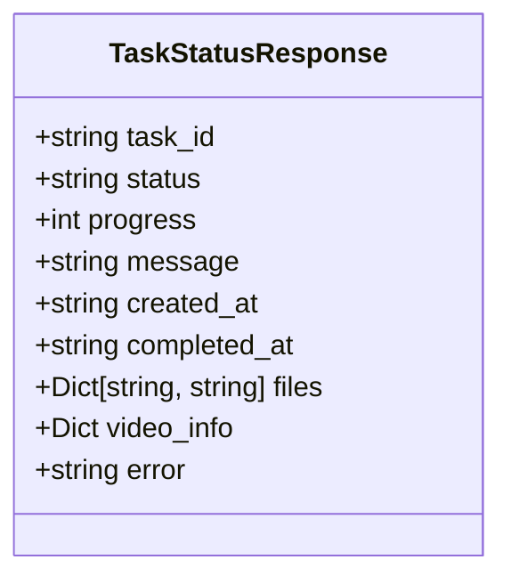
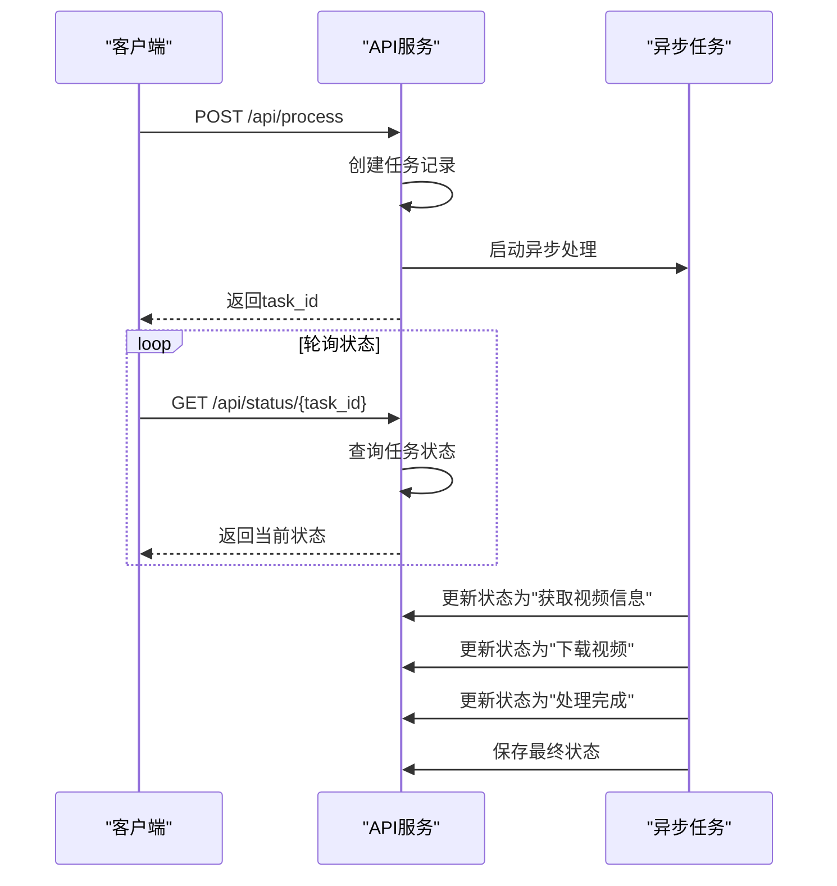

# GET /api/status/{task_id} - 任务状态查询

<cite>
**本文档引用文件**   
- [main.py](file://api/main.py)
</cite>

## 目录
1. [接口概述](#接口概述)
2. [请求信息](#请求信息)
3. [响应模型](#响应模型)
4. [响应示例](#响应示例)
5. [错误状态码](#错误状态码)
6. [轮询建议](#轮询建议)
7. [状态更新机制](#状态更新机制)

## 接口概述
GET /api/status/{task_id} 接口用于轮询指定任务的处理状态。该接口是视频处理流程中的关键组成部分，允许客户端查询由 POST /api/process 接口创建的任务的当前状态。通过此接口，客户端可以获取任务的进度、状态、处理结果等详细信息，从而实现对视频处理过程的实时监控。

## 请求信息
- **HTTP方法**: GET
- **路径**: /api/status/{task_id}
- **参数**:
  - `task_id` (路径参数): 任务ID，由 POST /api/process 接口返回
- **认证**: 无需认证
- **示例请求**: `GET /api/status/123e4567-e89b-12d3-a456-426614174000`

## 响应模型
接口返回 `TaskStatusResponse` 模型，包含以下字段：

| 字段 | 类型 | 描述 |
|------|------|------|
| task_id | string | 任务唯一标识符 |
| status | string | 任务状态：processing（处理中）、completed（已完成）、error（出错） |
| progress | integer | 处理进度（0-100） |
| message | string | 当前状态描述信息 |
| created_at | string | 任务创建时间（ISO 8601格式） |
| completed_at | string | 任务完成时间（ISO 8601格式，仅在完成或出错时存在） |
| files | object | 文件类型到下载链接的映射 |
| video_info | object | 视频元数据信息 |
| error | string | 错误信息（仅在出错时存在） |



**图表来源**
- [main.py](file://api/main.py#L86-L95)

**本节来源**
- [main.py](file://api/main.py#L86-L95)

## 响应示例
### 处理中状态
```json
{
  "task_id": "123e4567-e89b-12d3-a456-426614174000",
  "status": "processing",
  "progress": 45,
  "message": "正在下载视频...",
  "created_at": "2024-01-01T12:00:00",
  "video_info": {
    "title": "示例视频",
    "duration": 300,
    "uploader": "上传者"
  },
  "files": {}
}
```

### 完成状态
```json
{
  "task_id": "123e4567-e89b-12d3-a456-426614174000",
  "status": "completed",
  "progress": 100,
  "message": "处理完成！",
  "created_at": "2024-01-01T12:00:00",
  "completed_at": "2024-01-01T12:05:30",
  "video_info": {
    "title": "示例视频",
    "duration": 300,
    "uploader": "上传者"
  },
  "files": {
    "video": "/api/download/video_example_123abc.mp4",
    "audio": "/api/download/audio_example_123abc.mp3"
  }
}
```

### 出错状态
```json
{
  "task_id": "123e4567-e89b-12d3-a456-426614174000",
  "status": "error",
  "progress": 0,
  "message": "处理失败: 无法下载视频",
  "created_at": "2024-01-01T12:00:00",
  "completed_at": "2024-01-01T12:01:15",
  "video_info": {},
  "files": {},
  "error": "下载失败: HTTP 404"
}
```

**本节来源**
- [main.py](file://api/main.py#L320-L367)

## 错误状态码
- **404 Not Found**: 任务不存在。当提供的 `task_id` 在系统中找不到对应任务时返回此状态码。
- **500 Internal Server Error**: 内部服务器错误。当服务器在处理请求时遇到意外错误时返回此状态码。

## 轮询建议
为避免对服务器造成不必要的压力，建议客户端在轮询任务状态时遵循以下最佳实践：
- **轮询间隔**: 建议每2秒轮询一次。过于频繁的请求会增加服务器负载，而间隔过长则可能导致状态更新延迟。
- **超时机制**: 实现合理的超时机制，避免无限期等待任务完成。
- **状态变化检测**: 在接收到响应后，检查 `status` 和 `progress` 字段的变化，仅在状态发生变化时更新UI。
- **错误处理**: 正确处理404和500等错误状态码，提供适当的用户反馈。

## 状态更新机制
任务状态的更新机制与视频处理流程紧密相关，由异步任务 `process_video_task` 驱动：



**图表来源**
- [main.py](file://api/main.py#L171-L231)
- [main.py](file://api/main.py#L233-L325)
- [main.py](file://api/main.py#L320-L367)

**本节来源**
- [main.py](file://api/main.py#L171-L231)
- [main.py](file://api/main.py#L233-L325)
- [main.py](file://api/main.py#L320-L367)

当任务被创建后，系统会启动一个异步任务 `process_video_task` 来处理视频。在此过程中，任务状态会通过 `tasks[task_id].update()` 方法逐步更新，包括：
1. 初始化状态为"processing"，进度为0
2. 获取视频信息时，进度更新为10%
3. 开始下载视频时，进度更新为20%
4. 处理完成时，状态更新为"completed"，进度为100%
5. 发生错误时，状态更新为"error"

所有状态更新都会通过 `save_tasks(tasks)` 方法持久化到文件系统中，确保即使服务重启，任务状态也不会丢失。GET /api/status/{task_id} 接口直接从内存中的 `tasks` 字典读取最新状态并返回给客户端。