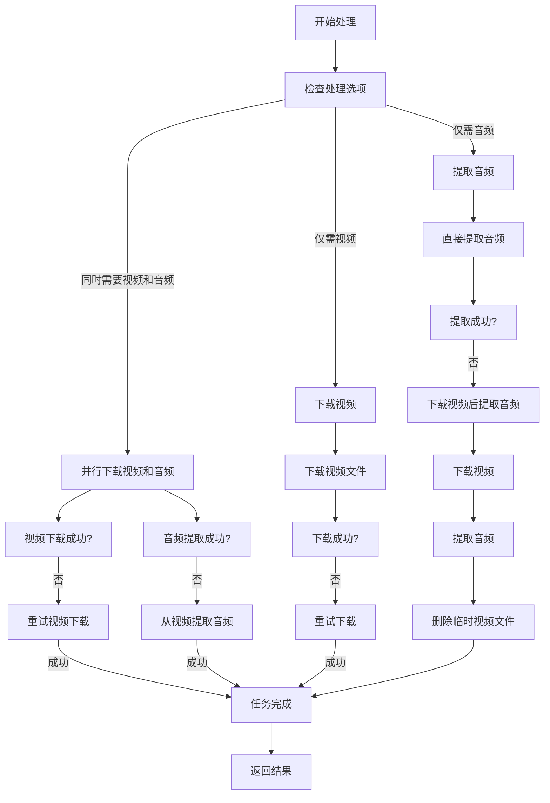

# 快速开始

<cite>
**本文档中引用的文件**  
- [README.md](file://README.md)
- [install.sh](file://install.sh)
- [start.py](file://start.py)
- [api/main.py](file://api/main.py)
- [api/video_processor.py](file://api/video_processor.py)
- [requirements.txt](file://requirements.txt)
- [cookies/COOKIES_GUIDE.md](file://cookies/COOKIES_GUIDE.md)
</cite>

## 目录
1. [环境准备](#环境准备)
2. [安装依赖](#安装依赖)
3. [服务启动](#服务启动)
4. [端到端使用示例](#端到端使用示例)
5. [常见问题排查](#常见问题排查)
6. [API接口说明](#api接口说明)

## 环境准备

在部署video-download-api服务之前，请确保您的系统满足以下环境要求：

### Python环境
- **Python版本**: 3.8或更高版本（推荐3.10-3.12）
- **重要提示**: Python 3.6/3.7版本不兼容最新依赖包，必须升级到3.8+

如果服务器Python版本过低，可使用项目提供的升级脚本：
```bash
chmod +x upgrade_python.sh
./upgrade_python.sh
```

### FFmpeg安装
FFmpeg是音频提取的必需组件，请根据您的操作系统选择安装方式：

**macOS**:
```bash
brew install ffmpeg
```

**Ubuntu/Debian**:
```bash
sudo apt install ffmpeg
```

**Windows**:
从FFmpeg官网下载并配置环境变量：https://ffmpeg.org/download.html

### 其他依赖
- **yt-dlp**: 项目已包含在requirements.txt中，安装时会自动下载
- **磁盘空间**: 确保有足够的临时存储空间用于视频处理

**Section sources**
- [README.md](file://README.md#L20-L40)
- [start.py](file://start.py#L61-L75)

## 安装依赖

### 方法一：自动安装（推荐）

```bash
# 克隆项目
git clone https://github.com/tmwgsicp/video-download-api.git
cd video-download-api

# 运行安装脚本
chmod +x install.sh
./install.sh
```

### 方法二：手动安装

```bash
# 1. 安装Python依赖
pip install -r requirements.txt

# 2. 安装FFmpeg（根据操作系统选择）
# macOS: brew install ffmpeg
# Ubuntu: sudo apt install ffmpeg

# 3. 创建必要的目录
mkdir -p temp
```

安装脚本会自动执行以下操作：
- 检查Python和pip环境
- 安装requirements.txt中的所有Python依赖
- 检测并尝试安装FFmpeg
- 创建temp临时目录用于存储下载文件
- 设置脚本执行权限

**Section sources**
- [install.sh](file://install.sh#L1-L94)
- [requirements.txt](file://requirements.txt#L1-L9)

## 服务启动

### 启动API服务

```bash
python3 start.py
```

### 开发模式启动（热重载）

```bash
python3 start.py --dev
```

### 服务验证

服务启动后，您可以通过以下方式验证服务是否正常运行：

1. **健康检查**: 访问 `http://localhost:8000/api/health`
2. **API文档**: 访问 `http://localhost:8000/docs`
3. **服务根路径**: 访问 `http://localhost:8000`

启动脚本会执行以下检查：
- 验证Python依赖是否完整安装
- 检查FFmpeg是否可用
- 创建临时目录
- 启动FastAPI服务器

**Section sources**
- [start.py](file://start.py#L61-L111)
- [api/main.py](file://api/main.py#L21-L25)

## 端到端使用示例

本示例将指导您完成从抖音视频链接提交到文件下载的完整流程。

### 步骤1：提交处理任务

```bash
curl -X POST "http://localhost:8000/api/process" \
     -H "Content-Type: application/json" \
     -d '{
       "url": "https://www.douyin.com/video/123456789",
       "extract_audio": true,
       "keep_video": true
     }'
```

**预期响应**:
```json
{
  "task_id": "a1b2c3d4-e5f6-7890-g1h2-i3j4k5l6m7n8",
  "message": "任务已创建，正在处理中...",
  "status_url": "/api/status/a1b2c3d4-e5f6-7890-g1h2-i3j4k5l6m7n8"
}
```

### 步骤2：查询任务状态

使用上一步返回的task_id查询处理状态：

```bash
curl "http://localhost:8000/api/status/a1b2c3d4-e5f6-7890-g1h2-i3j4k5l6m7n8"
```

**处理中响应**:
```json
{
  "task_id": "a1b2c3d4-e5f6-7890-g1h2-i3j4k5l6m7n8",
  "status": "processing",
  "progress": 50,
  "message": "正在下载视频...",
  "created_at": "2024-01-01T12:00:00"
}
```

**处理完成响应**:
```json
{
  "task_id": "a1b2c3d4-e5f6-7890-g1h2-i3j4k5l6m7n8",
  "status": "completed",
  "progress": 100,
  "message": "处理完成！",
  "created_at": "2024-01-01T12:00:00",
  "completed_at": "2024-01-01T12:05:30",
  "files": {
    "video": "/api/download/video_抖音视频标题_a1b2c3.mp4",
    "audio": "/api/download/audio_抖音视频标题_a1b2c3.mp3"
  },
  "video_info": {
    "title": "抖音视频标题",
    "duration": 60,
    "uploader": "创作者名称"
  }
}
```

### 步骤3：下载文件

根据状态查询返回的文件链接下载文件：

```bash
# 下载视频文件
curl -O "http://localhost:8000/api/download/video_抖音视频标题_a1b2c3.mp4"

# 下载音频文件
curl -O "http://localhost:8000/api/download/audio_抖音视频标题_a1b2c3.mp3"
```

**Section sources**
- [api/main.py](file://api/main.py#L171-L231)
- [api/main.py](file://api/main.py#L328-L352)
- [api/main.py](file://api/main.py#L355-L399)

## 常见问题排查

### 依赖缺失问题

**症状**: 启动时报错"缺少依赖包"或"未找到FFmpeg"

**解决方案**:
1. 重新运行安装脚本：
   ```bash
   ./install.sh
   ```
2. 手动安装Python依赖：
   ```bash
   pip install -r requirements.txt
   ```
3. 手动安装FFmpeg：
   - macOS: `brew install ffmpeg`
   - Ubuntu: `sudo apt install ffmpeg`

### 端口占用问题

**症状**: 启动时报错"端口已被占用"

**解决方案**:
1. 检查8000端口占用情况：
   ```bash
   netstat -an | grep 8000
   ```
2. 终止占用进程：
   ```bash
   lsof -i :8000
   kill -9 <PID>
   ```
3. 或修改端口号（需修改start.py中的PORT环境变量）

### Cookies配置错误

**症状**: 抖音视频下载失败，提示需要cookies

**解决方案**:
1. 确保cookies目录下有`douyin.netscape.txt`文件
2. 按照[COOKIES_GUIDE.md](file://cookies/COOKIES_GUIDE.md)获取正确的cookies
3. 检查cookies文件格式是否正确

### 网络连接问题

**症状**: 下载速度慢或超时

**解决方案**:
1. 检查网络连接
2. 尝试更换网络或使用VPN
3. 确保服务器可以访问目标视频平台

### 磁盘空间不足

**症状**: 下载大视频时失败

**解决方案**:
1. 检查磁盘空间：
   ```bash
   df -h
   ```
2. 清理temp目录中的临时文件
3. 确保有足够的空间存储视频文件

**Section sources**
- [README.md](file://README.md#L300-L350)
- [cookies/COOKIES_GUIDE.md](file://cookies/COOKIES_GUIDE.md#L1-L156)

## API接口说明

### 基本流程
1. **提交任务** → 2. **查询状态** → 3. **下载文件**

### API端点

#### 健康检查
```http
GET /api/health
```

#### 提交处理任务
```http
POST /api/process
Content-Type: application/json

{
  "url": "视频链接",
  "extract_audio": true,
  "keep_video": true
}
```

#### 查询任务状态
```http
GET /api/status/{task_id}
```

#### 下载文件
```http
GET /api/download/{filename}
```

### 处理策略

视频处理器采用智能回退机制确保处理成功率：



**Diagram sources**
- [api/video_processor.py](file://api/video_processor.py#L192-L343)
- [api/video_processor.py](file://api/video_processor.py#L461-L502)

**Section sources**
- [api/main.py](file://api/main.py#L21-L25)
- [api/video_processor.py](file://api/video_processor.py#L10-L502)