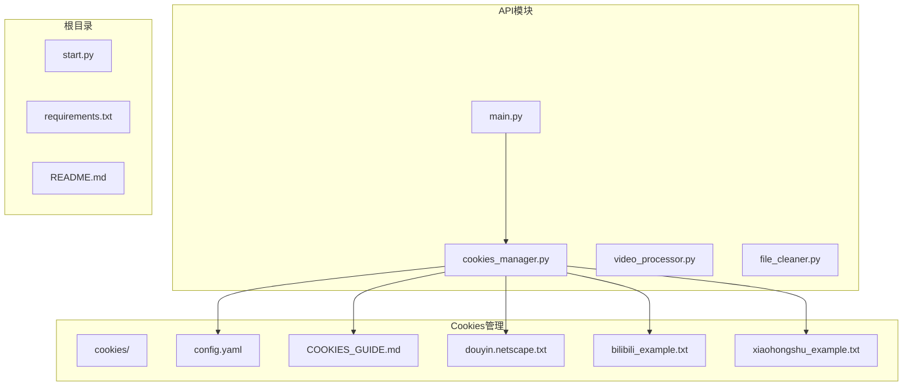
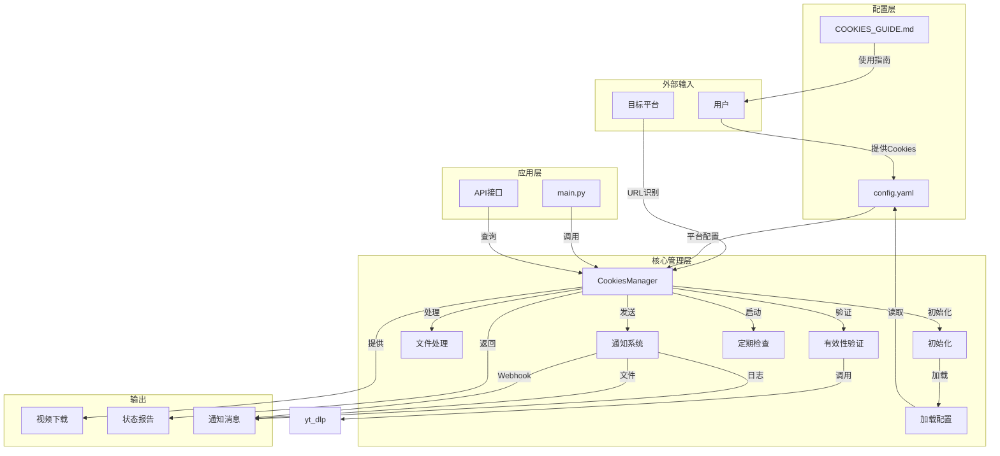
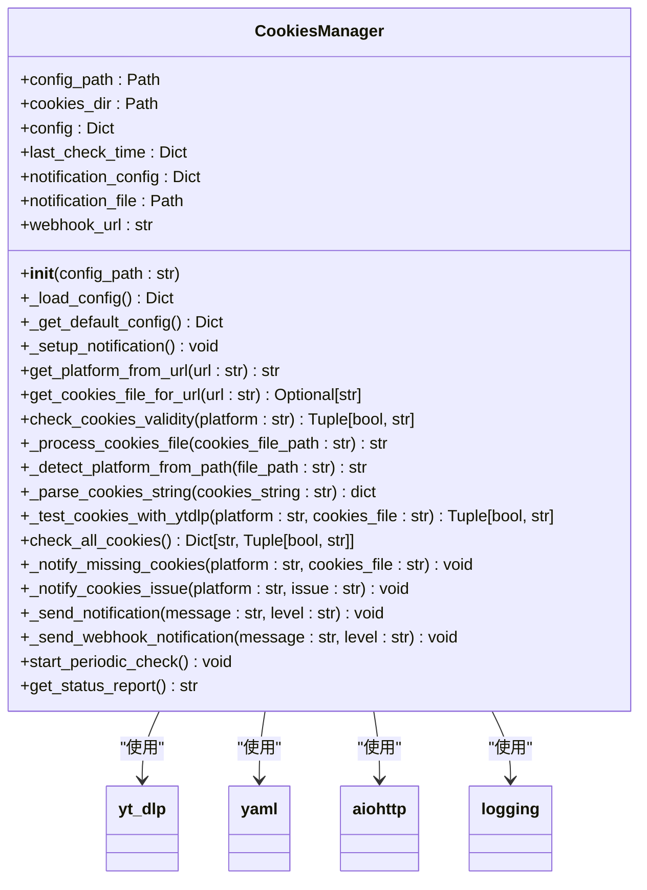
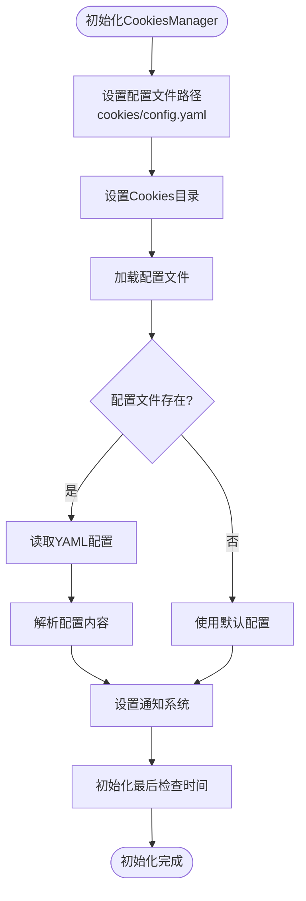
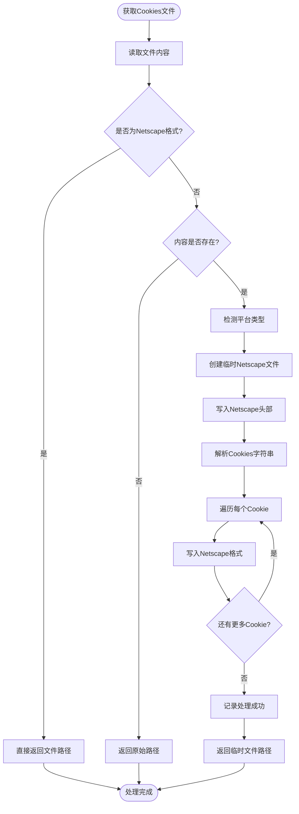
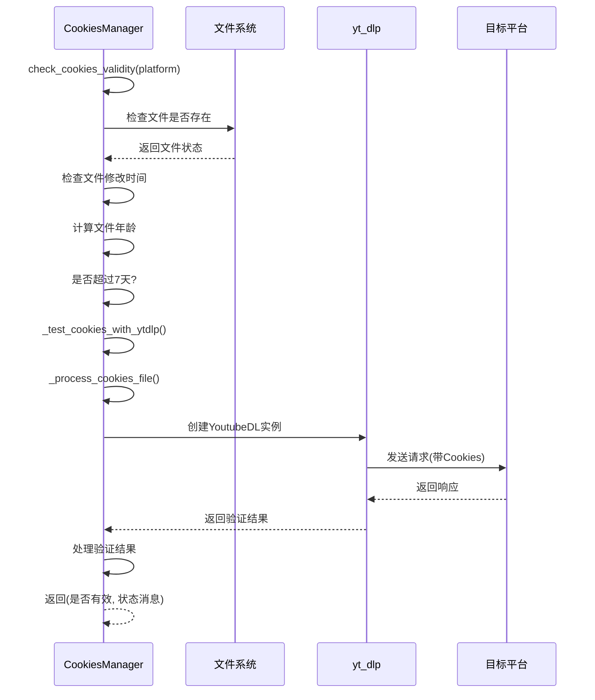
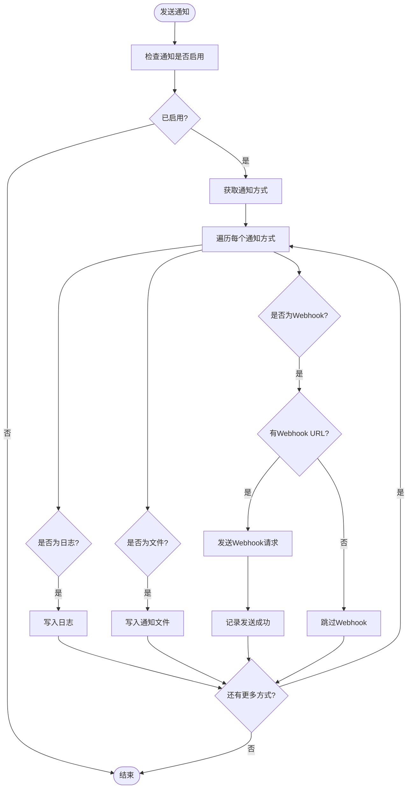
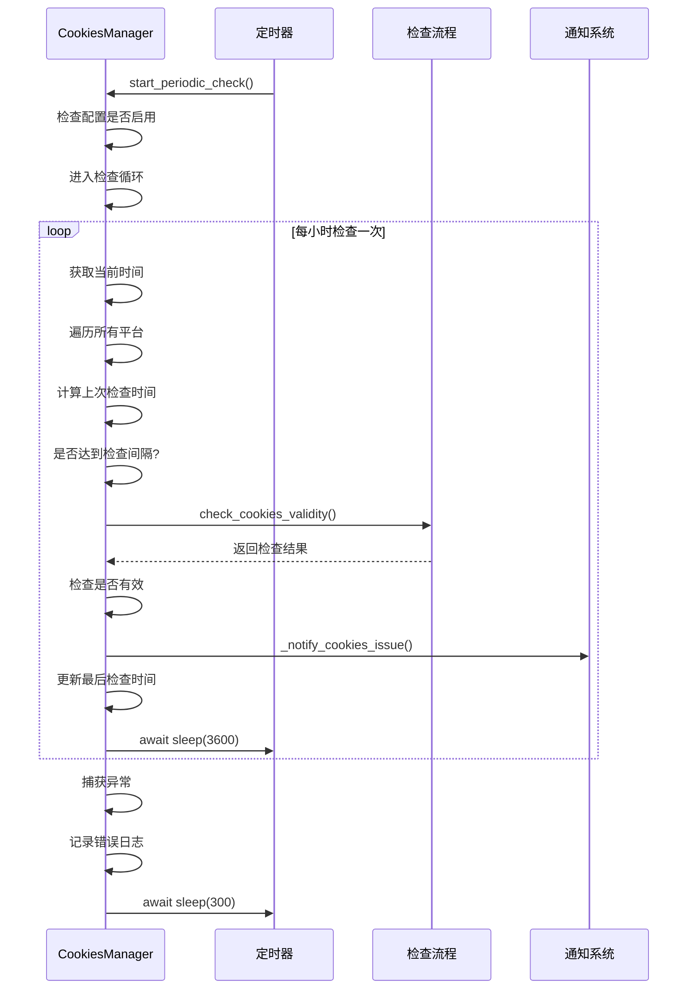
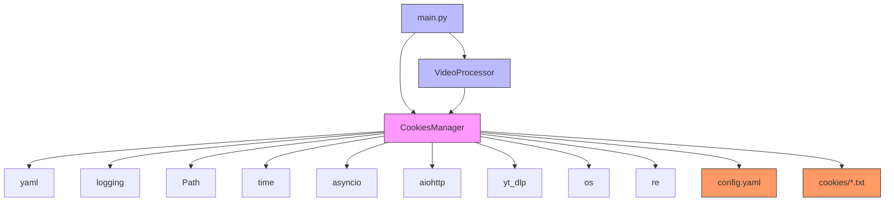

# Cookies管理功能

<cite>
**Referenced Files in This Document**   
- [cookies_manager.py](file://api/cookies_manager.py)
- [config.yaml](file://cookies/config.yaml)
- [COOKIES_GUIDE.md](file://cookies/COOKIES_GUIDE.md)
- [main.py](file://api/main.py)
</cite>

## 目录
1. [简介](#简介)
2. [项目结构](#项目结构)
3. [核心组件](#核心组件)
4. [架构概述](#架构概述)
5. [详细组件分析](#详细组件分析)
6. [依赖分析](#依赖分析)
7. [性能考虑](#性能考虑)
8. [故障排除指南](#故障排除指南)
9. [结论](#结论)

## 简介

本文档全面解析`cookies_manager.py`实现的Cookies管理体系。该系统负责管理、验证和维护用于访问受保护内容的Cookies文件，确保视频下载服务能够持续稳定地访问需要登录的平台内容。系统通过智能的文件格式转换、定期有效性检查和多渠道通知机制，为用户提供了一套完整的Cookies管理解决方案。

## 项目结构

项目结构清晰地分离了功能模块，将Cookies管理相关的文件集中存放，便于维护和管理。

**Diagram sources**
- [cookies_manager.py](file://api/cookies_manager.py#L1-L50)
- [config.yaml](file://cookies/config.yaml#L1-L10)

**Section sources**
- [cookies_manager.py](file://api/cookies_manager.py#L1-L50)
- [config.yaml](file://cookies/config.yaml#L1-L10)

## 核心组件

`CookiesManager`类是整个Cookies管理体系的核心，负责加载配置、处理文件格式、验证有效性并管理通知系统。该组件通过与`config.yaml`配置文件和`cookies`目录下的文件交互，实现了对多个平台Cookies的统一管理。

**Section sources**
- [cookies_manager.py](file://api/cookies_manager.py#L22-L50)
- [config.yaml](file://cookies/config.yaml#L1-L10)

## 架构概述

Cookies管理体系采用分层架构设计，各组件职责明确，协同工作以确保系统的稳定性和可靠性。

**Diagram sources**
- [cookies_manager.py](file://api/cookies_manager.py#L22-L50)
- [main.py](file://api/main.py#L30-L40)

## 详细组件分析

### CookiesManager类分析

`CookiesManager`类实现了完整的Cookies管理功能，包括配置加载、文件处理、有效性验证和通知系统。

#### 类结构图

**Diagram sources**
- [cookies_manager.py](file://api/cookies_manager.py#L22-L50)

### 初始化流程分析

`CookiesManager`的初始化过程是整个系统运行的基础，它负责加载配置并设置通知系统。

#### 初始化流程图

**Diagram sources**
- [cookies_manager.py](file://api/cookies_manager.py#L22-L33)

**Section sources**
- [cookies_manager.py](file://api/cookies_manager.py#L22-L33)

### 文件处理机制分析

系统支持多种Cookies文件格式，并能自动转换为yt-dlp兼容的Netscape格式。

#### 文件处理流程图

**Diagram sources**
- [cookies_manager.py](file://api/cookies_manager.py#L169-L220)

**Section sources**
- [cookies_manager.py](file://api/cookies_manager.py#L169-L220)

### 有效性验证流程分析

系统通过多种方式验证Cookies的有效性，确保服务的稳定运行。

#### 有效性验证序列图

**Diagram sources**
- [cookies_manager.py](file://api/cookies_manager.py#L129-L167)
- [cookies_manager.py](file://api/cookies_manager.py#L276-L334)

**Section sources**
- [cookies_manager.py](file://api/cookies_manager.py#L129-L167)
- [cookies_manager.py](file://api/cookies_manager.py#L276-L334)

### 通知系统分析

系统提供多渠道通知机制，确保用户能及时了解Cookies状态。

#### 通知系统流程图

**Diagram sources**
- [cookies_manager.py](file://api/cookies_manager.py#L376-L404)

**Section sources**
- [cookies_manager.py](file://api/cookies_manager.py#L376-L404)

### 定期检查机制分析

系统支持定期自动检查Cookies状态，确保及时发现和处理问题。

#### 定期检查序列图

**Diagram sources**
- [cookies_manager.py](file://api/cookies_manager.py#L444-L473)

**Section sources**
- [cookies_manager.py](file://api/cookies_manager.py#L444-L473)

## 依赖分析

Cookies管理体系与其他组件紧密协作，形成完整的视频下载服务。

**Diagram sources**
- [cookies_manager.py](file://api/cookies_manager.py#L1-L20)
- [main.py](file://api/main.py#L1-L20)

**Section sources**
- [cookies_manager.py](file://api/cookies_manager.py#L1-L50)
- [main.py](file://api/main.py#L1-L50)

## 性能考虑

Cookies管理体系在设计时充分考虑了性能因素，确保系统高效运行。

1. **异步处理**：使用`asyncio`实现非阻塞的定期检查和Webhook通知，避免阻塞主线程。
2. **缓存机制**：通过`last_check_time`字典缓存各平台的最后检查时间，避免频繁重复检查。
3. **批量处理**：`check_all_cookies`方法一次性检查所有平台的Cookies状态，减少系统调用开销。
4. **超时限制**：在`_test_cookies_with_ytdlp`方法中设置10秒超时，防止长时间等待影响服务响应。
5. **错误恢复**：定期检查循环中包含异常处理，确保单个平台检查失败不会影响其他平台的检查。

## 故障排除指南

当遇到Cookies相关问题时，可按照以下步骤进行排查：

### 常见问题及解决方案

| 问题现象 | 可能原因 | 解决方案 |
|---------|--------|---------|
| 抖音视频下载失败 | Cookies文件缺失或过期 | 检查`douyin.txt`文件是否存在，重新获取并更新Cookies |
| 提示"Fresh cookies needed" | 平台检测到自动化访问或Cookies无效 | 重新登录抖音，获取新的完整Cookies字符串 |
| B站会员内容无法访问 | B站Cookies不完整 | 确保`bilibili.txt`包含SESSDATA和bili_jct等关键字段 |
| 小红书内容访问受限 | 小红书Cookies过期 | 重新获取小红书Cookies并更新文件 |
| 通知功能不工作 | Webhook URL未配置 | 在`config.yaml`中配置正确的企微机器人Webhook URL |

### 调试步骤

1. **检查Cookies文件**：确认对应平台的Cookies文件存在且格式正确。
2. **查看日志信息**：检查API日志和`cookies_notifications.log`文件，获取详细的错误信息。
3. **手动验证**：访问`/api/cookies/status`接口，查看各平台Cookies的详细状态。
4. **重新获取Cookies**：按照`COOKIES_GUIDE.md`中的指南重新获取最新的Cookies。
5. **测试通知功能**：调用`/api/cookies/webhook/test`接口测试通知系统是否正常工作。

**Section sources**
- [COOKIES_GUIDE.md](file://cookies/COOKIES_GUIDE.md#L1-L150)

## 结论

Cookies管理体系通过`CookiesManager`类实现了对多平台Cookies的统一管理，为视频下载服务提供了稳定可靠的登录状态支持。系统具备以下优势：

1. **灵活的配置管理**：通过`config.yaml`文件定义各平台的Cookies使用策略，易于维护和扩展。
2. **智能的文件处理**：支持多种Cookies格式输入，并自动转换为yt-dlp兼容的Netscape格式。
3. **全面的有效性检查**：结合文件年龄检查和在线验证，确保Cookies的可用性。
4. **多渠道通知系统**：通过日志、文件和Webhook等多种方式及时通知用户Cookies状态。
5. **自动化的定期检查**：后台定期检查各平台Cookies状态，主动发现和处理问题。

该体系不仅解决了访问受保护内容的技术难题，还通过完善的文档和API接口，为用户提供了友好的使用体验，确保了服务的长期稳定运行。