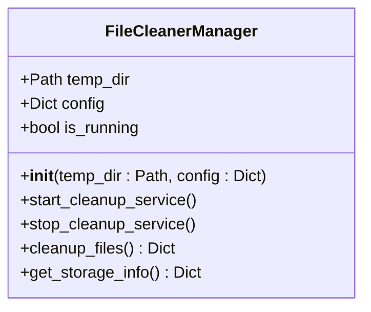
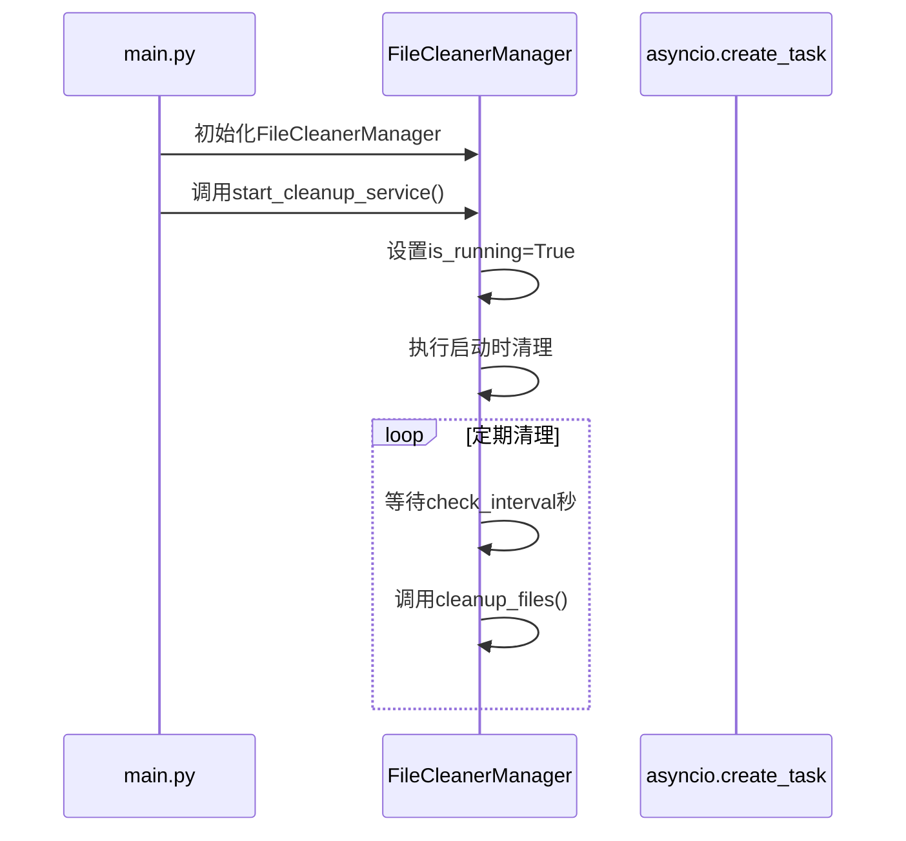
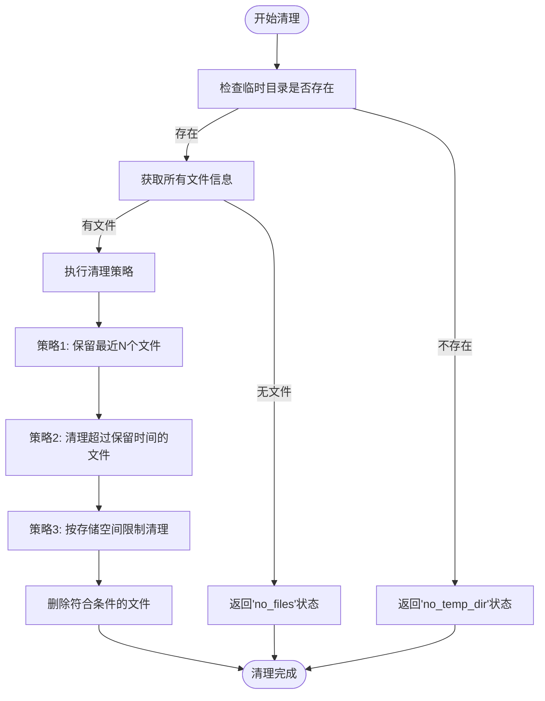
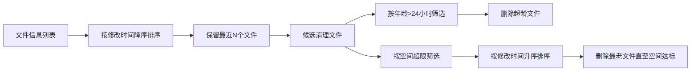
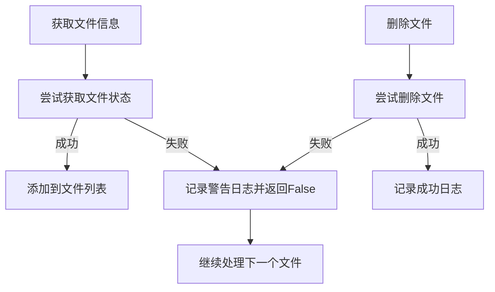

# 文件清理功能

<cite>
**本文档引用的文件**   
- [file_cleaner.py](file://api/file_cleaner.py)
- [main.py](file://api/main.py)
</cite>

## 目录
1. [文件清理机制概述](#文件清理机制概述)
2. [核心组件分析](#核心组件分析)
3. [清理策略执行流程](#清理策略执行流程)
4. [异常处理与日志记录](#异常处理与日志记录)
5. [磁盘空间保护机制](#磁盘空间保护机制)
6. [性能调优建议](#性能调优建议)
7. [常见问题与排查方法](#常见问题与排查方法)

## 文件清理机制概述

文件清理功能通过 `FileCleanerManager` 类实现自动化清理机制，旨在定期扫描临时目录下的文件并根据预设策略进行清理，防止磁盘空间耗尽。该模块在系统启动时自动初始化，并通过异步任务持续运行。

清理服务默认配置为每小时（3600秒）检查一次临时目录，可依据文件年龄、数量和总存储占用等多种条件触发清理操作。整个机制设计为非阻塞式运行，确保不影响主服务的正常运作。

**Section sources**
- [file_cleaner.py](file://api/file_cleaner.py#L15-L197)
- [main.py](file://api/main.py#L54-L54)

## 核心组件分析

`FileCleanerManager` 是文件清理功能的核心类，负责管理整个清理流程的生命周期。该类在初始化时接收临时目录路径和可选的配置参数，若未提供配置则使用内置的默认配置。

**Diagram sources**
- [file_cleaner.py](file://api/file_cleaner.py#L15-L197)

启动流程由 `start_cleanup_service` 方法控制，该方法首先检查清理服务是否已启用，然后设置运行状态标志，并立即执行一次启动时清理。随后进入循环，按照配置的检查间隔定期调用清理方法。

**Diagram sources**
- [file_cleaner.py](file://api/file_cleaner.py#L41-L62)
- [main.py](file://api/main.py#L57-L75)

**Section sources**
- [file_cleaner.py](file://api/file_cleaner.py#L18-L28)
- [file_cleaner.py](file://api/file_cleaner.py#L41-L62)

## 清理策略执行流程

文件清理流程包含三个主要步骤：获取文件信息、执行清理策略和删除文件。首先，`_get_files_info` 方法扫描临时目录，收集所有非隐藏文件的详细信息，包括文件路径、名称、大小、修改时间和年龄（小时）。

**Diagram sources**
- [file_cleaner.py](file://api/file_cleaner.py#L98-L116)
- [file_cleaner.py](file://api/file_cleaner.py#L69-L96)

清理策略由 `_execute_cleanup_strategy` 方法实现，采用多级策略组合方式：

1. **保留最近文件**：根据 `preserve_recent_files` 配置（默认10个），保留最新修改的文件
2. **按时间清理**：根据 `file_retention_hours` 配置（默认24小时），清理超过保留时间的文件
3. **按空间清理**：根据 `max_storage_mb` 配置（默认1000MB），当总存储超过限制时，从最老文件开始清理直至满足空间要求

**Diagram sources**
- [file_cleaner.py](file://api/file_cleaner.py#L118-L170)

**Section sources**
- [file_cleaner.py](file://api/file_cleaner.py#L69-L96)
- [file_cleaner.py](file://api/file_cleaner.py#L118-L170)

## 异常处理与日志记录

清理模块实现了完善的异常处理机制，确保在各种异常情况下仍能稳定运行。在文件信息获取阶段，如果某个文件无法访问，系统会记录警告日志但继续处理其他文件，避免因单个文件问题导致整个清理流程中断。

**Diagram sources**
- [file_cleaner.py](file://api/file_cleaner.py#L98-L116)
- [file_cleaner.py](file://api/file_cleaner.py#L172-L181)

在清理服务主循环中，系统捕获所有异常并记录错误日志，然后等待60秒后重试，防止因临时性问题导致服务永久停止。这种设计确保了服务的高可用性。

文件删除操作在 `_delete_file` 方法中执行，使用 `unlink()` 方法删除文件。如果删除失败（如文件被占用或权限不足），系统会记录警告日志并返回 `False`，但不会中断整个清理流程。

**Section sources**
- [file_cleaner.py](file://api/file_cleaner.py#L172-L181)
- [file_cleaner.py](file://api/file_cleaner.py#L41-L62)

## 磁盘空间保护机制

文件清理模块通过多种机制防止磁盘空间耗尽，保障服务长期稳定运行。首先，系统在启动时自动执行一次清理操作（`cleanup_on_startup` 默认为 `True`），确保服务启动时临时目录处于清洁状态。

其次，通过 `max_storage_mb` 配置项（默认1000MB）设置磁盘使用上限。当临时目录总大小超过此限制时，即使文件未达到24小时保留期限，系统也会启动清理流程，优先删除最老的文件直至总大小低于限制。

**Diagram sources**
- [file_cleaner.py](file://api/file_cleaner.py#L118-L170)

此外，系统提供了 `get_storage_info` 方法，可实时获取临时目录的存储信息，包括文件总数、总大小、最老和最新文件的年龄等，便于监控和诊断。

**Section sources**
- [file_cleaner.py](file://api/file_cleaner.py#L183-L197)
- [main.py](file://api/main.py#L560-L576)

## 性能调优建议

为优化文件清理功能的性能，建议根据实际使用场景调整以下配置参数：

- **扫描间隔**：`check_interval` 默认为3600秒（1小时）。在高频率使用场景下，可适当缩短间隔（如1800秒/30分钟），但需权衡系统资源消耗
- **磁盘使用上限**：`max_storage_mb` 默认为1000MB（1GB）。可根据服务器磁盘容量和业务需求调整，建议设置为磁盘总容量的10-20%
- **文件保留数量**：`preserve_recent_files` 默认为10个。可根据最近文件访问频率调整，确保常用文件不会被误删
- **文件保留时间**：`file_retention_hours` 默认为24小时。可根据业务需求调整，如需要更长的文件保留期可增加此值

建议定期监控 `get_storage_info` API 返回的存储信息，根据实际使用情况动态调整配置。在磁盘空间紧张的环境中，可考虑将临时目录设置在独立的磁盘分区上。

**Section sources**
- [file_cleaner.py](file://api/file_cleaner.py#L30-L39)
- [main.py](file://api/main.py#L560-L576)

## 常见问题与排查方法

### 清理任务未执行

**可能原因**：
- 清理服务被禁用（`enabled` 配置为 `False`）
- 临时目录不存在或路径错误
- 异步任务创建失败

**排查方法**：
1. 检查日志中是否有 "文件清理服务已禁用" 的提示
2. 确认 `TEMP_DIR` 目录是否存在且可访问
3. 检查应用启动日志，确认 `start_cleanup_service` 是否被成功调用

### 文件残留问题

**可能原因**：
- 文件被其他进程占用，无法删除
- 权限不足，无法删除文件
- 文件名包含特殊字符导致处理异常

**排查方法**：
1. 查看日志中是否有 "删除文件失败" 的警告信息
2. 检查文件是否被其他程序打开
3. 确认运行服务的用户对临时目录有写权限
4. 使用 `get_storage_info` API 检查残留文件的特征

### 磁盘空间持续增长

**可能原因**：
- 清理间隔过长，文件生成速度超过清理速度
- 磁盘使用上限设置过高
- 最近文件保留数量过多

**排查方法**：
1. 监控 `get_storage_info` 返回的 `total_size_mb` 变化趋势
2. 调整 `check_interval` 和 `max_storage_mb` 配置
3. 检查是否有异常大量的文件生成

**Section sources**
- [file_cleaner.py](file://api/file_cleaner.py#L69-L96)
- [file_cleaner.py](file://api/file_cleaner.py#L172-L181)
- [main.py](file://api/main.py#L579-L595)