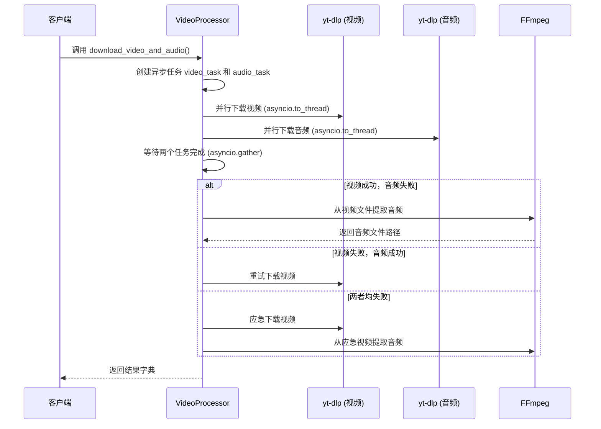
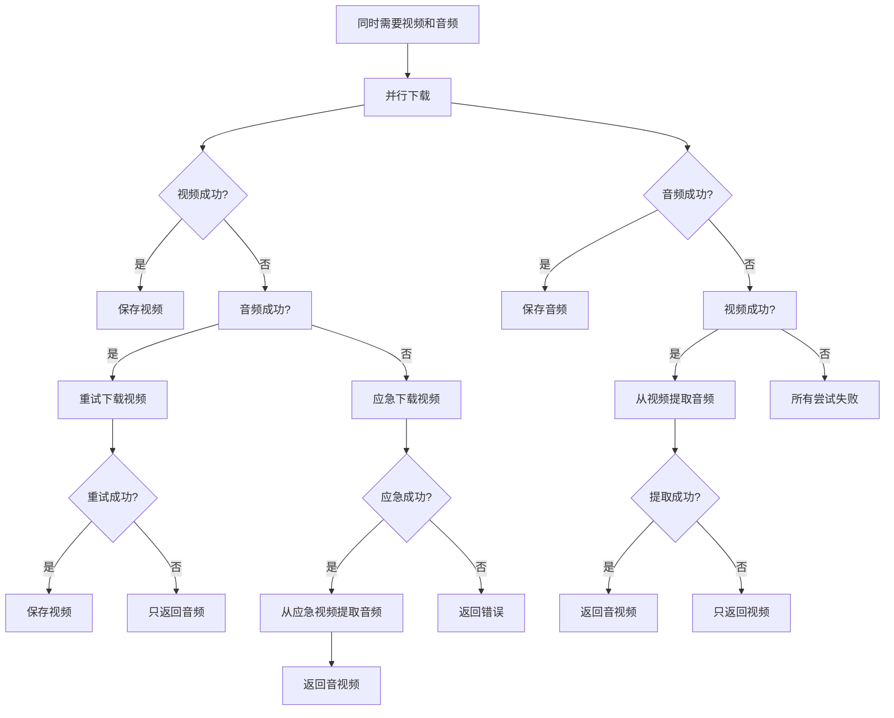
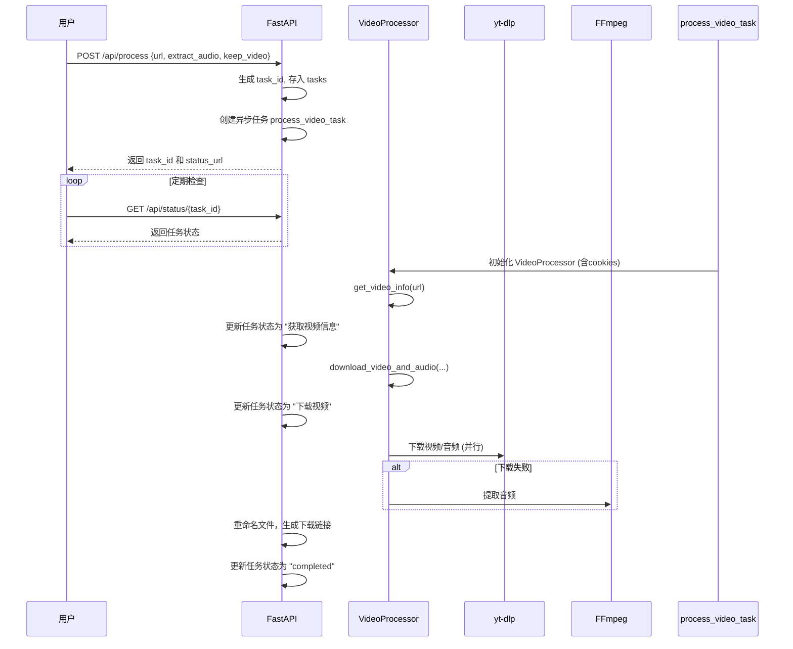

# 视频处理功能

<cite>
**本文档引用的文件**  
- [video_processor.py](file://api/video_processor.py)
- [main.py](file://api/main.py)
- [cookies_manager.py](file://api/cookies_manager.py)
- [file_cleaner.py](file://api/file_cleaner.py)
</cite>

## 目录
1. [简介](#简介)
2. [核心处理机制](#核心处理机制)
3. [智能格式选择策略](#智能格式选择策略)
4. [平台特定策略](#平台特定策略)
5. [异步并行处理流程](#异步并行处理流程)
6. [异常处理与回退机制](#异常处理与回退机制)
7. [抖音短链接解析](#抖音短链接解析)
8. [音频提取与FFmpeg集成](#音频提取与ffmpeg集成)
9. [调用流程分析](#调用流程分析)
10. [性能优化建议](#性能优化建议)
11. [常见问题与解决方案](#常见问题与解决方案)
12. [结论](#结论)

## 简介
`video-download-api` 是一个基于 `yt-dlp` 的视频下载与音频提取服务，核心功能由 `VideoProcessor` 类实现。该系统支持多平台视频处理，具备智能格式选择、异步并行下载、多层回退机制和平台特定优化等高级特性。文档深入阐述其核心机制，包括格式选择策略、异常处理、平台适配和性能优化。

## 核心处理机制

`VideoProcessor` 类是整个系统的核心，负责协调视频下载、音频提取和平台适配。它通过 `yt-dlp` 库与各大视频平台交互，并结合 `FFmpeg` 进行音视频处理。

**核心组件与职责**：
- **`video_opts`**：定义了视频下载的多层回退格式选择策略。
- **`audio_opts`**：定义了音频提取的优先级和后处理流程。
- **`platform_strategies`**：存储各平台的特定配置，实现差异化处理。
- **`_resolve_douyin_url`**：专门处理抖音短链接重定向。
- **`_extract_audio_from_video`**：利用 `FFmpeg` 从视频文件中提取高质量音频。

该机制确保了在各种网络环境和平台限制下，系统仍能以最高成功率完成任务。

**Section sources**
- [video_processor.py](file://api/video_processor.py#L13-L82)

## 智能格式选择策略

系统采用了一套精心设计的多层回退格式选择策略，以确保在不同平台和网络条件下都能成功下载。

### 视频下载策略 (`video_opts`)
```mermaid
flowchart TD
A[开始] --> B{优先尝试中等质量<br/>合并格式<br/>best[height<=720][filesize<100M]}
B --> C{分离流自动合并<br/>(B站等)<br/>worstvideo[height>=360]+worstaudio}
C --> D{通用分离流合并<br/>worstvideo+worstaudio}
D --> E{单独视频回退<br/>best[height<=720]/best[height<=480]}
E --> F{最终兜底策略<br/>worstvideo+bestaudio/worst}
F --> G[成功下载]
```

**策略解析**：
1.  **优先级1 - 高质量合并流**：`best[height<=720][filesize<100M]` 优先选择高度不超过720p且文件大小合理的最佳合并格式，平衡画质与效率。
2.  **优先级2 - 分离流合并**：`worstvideo[height>=360]+worstaudio` 针对B站等平台，要求视频流高度不低于360p，与音频流合并，确保基础画质。
3.  **优先级3 - 通用分离流合并**：`worstvideo+worstaudio` 作为通用方案，下载最差的视频和音频流并合并。
4.  **优先级4 - 单独视频回退**：`best[height<=720]/best[height<=480]` 如果合并失败，尝试下载单独的视频文件。
5.  **最终兜底**：`worstvideo+bestaudio/worst` 作为最后手段，确保至少能下载到内容。

### 音频提取策略 (`audio_opts`)
```mermaid
flowchart TD
A[开始] --> B{优先选择小文件<br/>最佳音频<br/>bestaudio[filesize<50M]}
B --> C{选择最佳音频<br/>bestaudio}
C --> D{选择小文件<br/>最佳格式<br/>best[filesize<50M]}
D --> E{最终兜底<br/>best}
E --> F[使用FFmpeg转码为MP3]
F --> G[成功提取]
```

**策略解析**：
1.  **优先级1 - 小文件最佳音频**：`bestaudio[filesize<50M]` 优先选择文件大小合理的最佳纯音频流，避免下载超大文件。
2.  **优先级2 - 最佳音频**：`bestaudio` 选择质量最高的纯音频流。
3.  **优先级3 - 小文件最佳格式**：`best[filesize<50M]` 如果没有纯音频流，选择一个文件大小合理的最佳格式（可能是合并流）。
4.  **最终兜底**：`best` 选择质量最高的任何格式。
5.  **后处理**：通过 `FFmpegExtractAudio` 后处理器，将提取的音频统一转换为192kbps的MP3格式。

**Diagram sources**
- [video_processor.py](file://api/video_processor.py#L50-L82)

## 平台特定策略

系统通过 `platform_strategies` 字典为不同平台提供定制化配置，以应对各平台的反爬虫机制和内容分发特点。

### B站 (Bilibili) 策略
```python
def _get_bilibili_strategy(self):
    return {
        'format': 'worstvideo[height>=360]+worstaudio/worstvideo+worstaudio/worst',
    }
```
**关键点**：
- **`worstvideo[height>=360]`**：这是B站策略的核心。B站的视频和音频流通常是分离的。此配置强制 `yt-dlp` 选择高度不低于360p的最差视频流，确保即使在低带宽下也能获得一个可接受的最低分辨率视频，避免下载到模糊不清的极低质量视频。随后与最差音频流合并，保证音画同步。

**Section sources**
- [video_processor.py](file://api/video_processor.py#L154-L158)

### 抖音 (Douyin) 策略
```python
def _get_douyin_strategy(self):
    return {
        'format': 'best[height<=720]/best',
        'http_headers': { ... }, # 详细的浏览器头信息
        'extractor_args': {
            'douyin': {
                'api_hostname': 'www.douyin.com'
            }
        }
    }
```
**关键点**：
- **`best[height<=720]`**：优先下载720p及以下的最佳质量视频，避免因请求过高分辨率而被拒绝。
- **伪造浏览器头**：提供完整的 `User-Agent`、`Accept` 等头信息，模拟真实浏览器访问，绕过基础的反爬检测。
- **指定API主机**：通过 `extractor_args` 明确指定 `yt-dlp` 使用 `www.douyin.com` 作为API主机，确保使用正确的数据接口。

**Section sources**
- [video_processor.py](file://api/video_processor.py#L129-L152)

### 小红书 (Xiaohongshu) 策略
```python
def _get_xiaohongshu_strategy(self):
    return {
        'format': 'best[height<=720]/best',
    }
```
**关键点**：
- 与抖音类似，采用 `best[height<=720]` 策略，优先保证中等画质的下载成功率。

**Section sources**
- [video_processor.py](file://api/video_processor.py#L160-L164)

### 其他平台
- **YouTube**：`best[height<=1080]/best`，允许下载最高1080p的视频。
- **TikTok**：`best[height<=720]/best`，与抖音策略一致。

## 异步并行处理流程

`download_video_and_audio` 方法是处理流程的核心，它利用 `asyncio` 实现了高效的异步并行处理。



**流程解析**：
1.  **任务创建**：当 `keep_video` 和 `extract_audio` 均为 `True` 时，系统会立即创建两个异步任务：`_download_video_only` 和 `_download_audio_only`。
2.  **并行执行**：`asyncio.gather` 会同时等待这两个任务的完成，实现了真正的并行下载，显著缩短了总处理时间。
3.  **结果聚合**：无论哪个任务先完成，`gather` 都会等待另一个任务结束，然后统一处理结果。

**Section sources**
- [video_processor.py](file://api/video_processor.py#L192-L343)

## 异常处理与回退机制

系统设计了完善的异常处理和多层回退机制，确保在各种失败场景下仍能提供最佳结果。

### 双向回退逻辑


**关键回退场景**：
1.  **音频失败，视频成功**：系统会立即调用 `_extract_audio_from_video`，利用 `FFmpeg` 从已下载的视频文件中提取音频，确保用户最终能获得音频文件。
2.  **视频失败，音频成功**：系统会尝试重新下载一次视频。如果重试失败，则接受部分成功的结果，仅返回音频文件。
3.  **两者均失败**：系统进入应急模式，尝试下载视频（`_emergency`），成功后立即从中提取音频，作为最后的保障。

### 边界情况检查
- 在方法开始时，会检查 `not extract_audio and not keep_video`，如果两者都为 `False`，则直接抛出 `ValueError`，防止无效请求。

**Section sources**
- [video_processor.py](file://api/video_processor.py#L192-L343)

## 抖音短链接解析

抖音的短链接（`v.douyin.com`）需要特殊处理，因为它们是重定向链接。

```python
def _resolve_douyin_url(self, url: str) -> str:
    if 'v.douyin.com' not in url:
        return url
    try:
        response = requests.get(url, headers=headers, allow_redirects=True, timeout=10)
        final_url = response.url
        # 验证final_url是否为有效的抖音视频URL
        if 'douyin.com' in final_url and ('video' in final_url or re.search(r'/\d+/', final_url)):
            return final_url
        else:
            return url # 让yt-dlp自己处理
    except Exception as e:
        return url # 失败时使用原始URL
```

**处理流程**：
1.  **识别**：通过 `v.douyin.com` 判断是否为短链接。
2.  **跟踪重定向**：使用 `requests.get` 并设置 `allow_redirects=True`，让库自动跟随重定向，获取最终的真实URL。
3.  **验证**：检查最终URL是否包含 `douyin.com` 和视频ID（`/video/` 或数字ID），确保其有效性。
4.  **降级**：如果解析或验证失败，直接返回原始URL，交由 `yt-dlp` 的内置提取器处理。

**Section sources**
- [video_processor.py](file://api/video_processor.py#L99-L127)

## 音频提取与FFmpeg集成

当直接下载音频失败时，系统会从视频文件中提取音频，这是通过 `FFmpeg` 实现的。

```python
async def _extract_audio_from_video(self, video_path: str, output_dir: Path, unique_id: str) -> Optional[str]:
    cmd = [
        'ffmpeg', '-i', video_path,
        '-vn',  # 不处理视频流
        '-acodec', 'mp3',  # 音频编码器
        '-ab', '192k',  # 音频比特率
        '-ar', '44100',  # 采样率
        '-y',  # 覆盖输出文件
        str(audio_path)
    ]
    await asyncio.to_thread(subprocess.run, cmd, capture_output=True, check=True)
```

**关键参数**：
- **`-vn`**：忽略所有视频流，只处理音频。
- **`-acodec mp3`**：指定音频编码器为MP3。
- **`-ab 192k`**：设置音频比特率为192kbps，保证音质。
- **`-ar 44100`**：设置采样率为44.1kHz，符合CD音质标准。
- **`-y`**：自动覆盖同名输出文件。

此方法通过 `asyncio.to_thread` 在异步环境中安全地调用同步的 `subprocess.run`，避免阻塞事件循环。

**Section sources**
- [video_processor.py](file://api/video_processor.py#L399-L427)

## 调用流程分析

从API请求到文件生成的完整流程如下：



**流程说明**：
1.  **请求接收**：FastAPI接收请求，生成任务ID并返回，实现非阻塞。
2.  **异步处理**：`process_video_task` 在后台异步执行，不阻塞API。
3.  **状态查询**：用户可通过 `GET /api/status/{task_id}` 实时查询进度。
4.  **文件管理**：下载完成后，文件被重命名为包含标题和任务ID的格式，并生成下载链接。

**Section sources**
- [main.py](file://api/main.py#L100-L300)

## 性能优化建议

1.  **并发处理**：充分利用 `asyncio` 的并行下载能力，同时请求视频和音频。
2.  **资源清理**：`FileCleanerManager` 会定期清理 `temp` 目录下的过期文件（默认24小时），防止磁盘空间耗尽。
3.  **Cookies缓存**：`CookiesManager` 会缓存有效的cookies文件，并定期检查其有效性，避免重复登录。
4.  **格式预筛选**：通过 `filesize<100M` 等条件限制，避免下载超大文件，节省带宽和存储。
5.  **异步I/O**：所有网络请求和文件操作都设计为异步或通过 `to_thread` 执行，最大化事件循环效率。

## 常见问题与解决方案

| 问题现象 | 可能原因 | 解决方案 |
| :--- | :--- | :--- |
| **下载超时** | 网络延迟高或服务器响应慢 | 检查网络连接；在 `yt-dlp` 配置中增加 `--socket-timeout` 参数。 |
| **格式不兼容** | 平台更新了DRM或加密 | 更新 `yt-dlp` 到最新版本；检查是否需要新的cookies。 |
| **B站视频模糊** | 未使用 `height>=360` 策略 | 确保 `video_opts` 中的B站策略正确配置。 |
| **抖音链接无法解析** | 短链接重定向失败 | 检查 `requests` 库是否正常；确认 `User-Agent` 头未被屏蔽。 |
| **音频提取失败** | `FFmpeg` 未安装或路径错误 | 确保系统已安装 `FFmpeg` 并可在命令行调用。 |
| **磁盘空间不足** | 临时文件未及时清理 | 检查 `FileCleanerManager` 是否正常运行；调整 `max_storage_mb` 配置。 |

## 结论

`video-download-api` 的 `VideoProcessor` 类通过一套复杂而健壮的机制，实现了高效、可靠的视频下载与音频提取功能。其核心优势在于：
- **智能的多层回退策略**：确保在各种失败场景下都能提供最佳结果。
- **平台差异化适配**：针对B站、抖音等平台的特性进行优化。
- **高效的异步并行处理**：最大化利用系统资源，缩短处理时间。
- **完善的异常处理**：从短链接解析到音频提取，每个环节都有备用方案。

这套设计模式为构建高可用的媒体处理服务提供了优秀的实践范例。