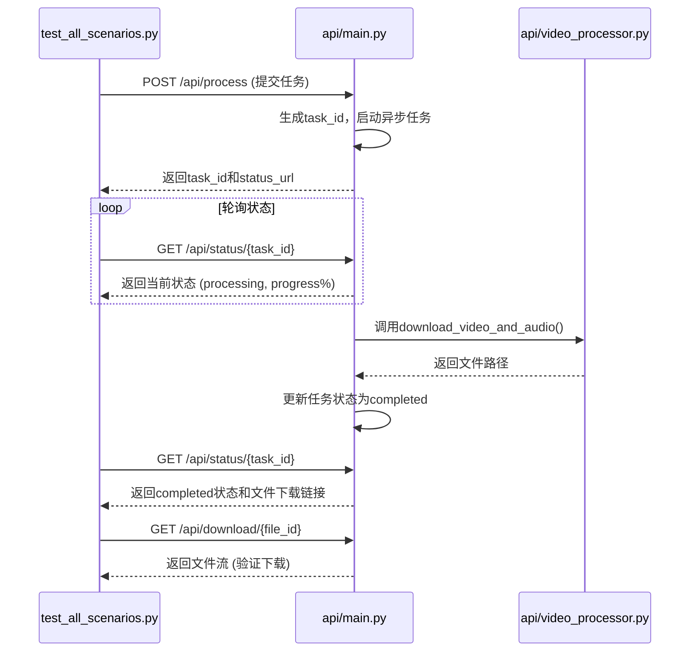

# 测试策略

<cite>
**本文档中引用的文件**  
- [test_all_scenarios.py](file://test_all_scenarios.py)
- [api/main.py](file://api/main.py)
- [api/video_processor.py](file://api/video_processor.py)
- [api/cookies_manager.py](file://api/cookies_manager.py)
- [api/file_cleaner.py](file://api/file_cleaner.py)
</cite>

## 目录
1. [引言](#引言)
2. [端到端测试策略](#端到端测试策略)
3. [核心测试流程分析](#核心测试流程分析)
4. [测试脚本执行与结果分析](#测试脚本执行与结果分析)
5. [回归测试与新增功能验证](#回归测试与新增功能验证)
6. [多平台兼容性与稳定性保障](#多平台兼容性与稳定性保障)
7. [未来测试扩展建议](#未来测试扩展建议)
8. [结论](#结论)

## 引言
`video-download-api` 是一个用于下载视频并提取音频的API服务，支持抖音、B站、小红书等多个平台。为确保其在真实用户场景下的稳定性和可靠性，项目采用端到端（E2E）测试策略，通过 `test_all_scenarios.py` 脚本全面验证API的核心功能流程。该测试覆盖了从视频链接提交、任务状态轮询到文件下载的完整工作流，确保系统在各种参数组合下的行为符合预期。

## 端到端测试策略
项目采用端到端测试策略，直接模拟真实用户调用API的完整流程。测试脚本 `test_all_scenarios.py` 作为独立的客户端，通过HTTP请求与运行中的API服务器进行交互，验证整个系统的集成正确性。

该策略的核心优势在于：
- **真实场景模拟**：测试直接调用API的 `/api/process`、`/api/status` 和 `/api/download` 等端点，与生产环境的用户行为完全一致。
- **状态流验证**：完整验证任务从“提交”到“处理中”再到“完成”的全生命周期状态流转。
- **结果完整性检查**：不仅检查API响应，还实际下载生成的文件以验证其完整性和可访问性。



**图示来源**
- [test_all_scenarios.py](file://test_all_scenarios.py#L64-L179)
- [api/main.py](file://api/main.py#L171-L325)
- [api/video_processor.py](file://api/video_processor.py#L10-L502)

**本节来源**
- [test_all_scenarios.py](file://test_all_scenarios.py#L12-L296)

## 核心测试流程分析
`test_all_scenarios.py` 脚本通过 `test_scenario` 函数实现对特定场景的完整测试，其流程严格遵循API的使用规范。

### 1. 视频链接提交
测试流程始于向 `/api/process` 端点发送POST请求，提交包含视频URL和处理选项的JSON数据。
- **请求参数**：`url`（视频链接）、`extract_audio`（是否提取音频）、`keep_video`（是否保留视频）。
- **预期响应**：成功时返回200状态码和包含 `task_id` 的JSON响应。测试脚本会验证 `task_id` 是否存在，并将其用于后续的状态查询。

**本节来源**
- [test_all_scenarios.py](file://test_all_scenarios.py#L81-L98)
- [api/main.py](file://api/main.py#L171-L185)

### 2. 任务状态轮询
提交任务后，测试脚本进入轮询状态，通过 `get_task_status` 函数定期调用 `/api/status/{task_id}` 端点。
- **轮询机制**：每3秒查询一次，最多等待5分钟（`max_wait_time = 300`），防止测试无限期挂起。
- **状态监控**：脚本实时打印任务的 `status`、`progress` 和 `message`，提供详细的执行过程日志。
- **结果验证**：
  - 当 `status` 变为 `completed` 时，检查返回的 `files` 字典中是否包含符合预期的 `video` 和 `audio` 文件路径。
  - 当 `status` 变为 `error` 时，记录错误信息并判定测试失败。

**本节来源**
- [test_all_scenarios.py](file://test_all_scenarios.py#L100-L179)
- [api/main.py](file://api/main.py#L328-L352)

### 3. 文件下载验证
这是端到端测试的关键环节，确保生成的文件不仅存在，而且内容完整。
- **下载测试**：`test_actual_download` 函数使用 `requests.get` 的流式下载模式，向 `/api/download/{file_id}` 发起请求。
- **完整性验证**：
  - 检查HTTP响应状态码是否为200。
  - 验证 `Content-Type` 头部是否与文件类型匹配。
  - 使用 `tempfile.NamedTemporaryFile` 创建临时文件，仅下载前10KB数据进行验证，避免因下载大文件而耗时过长。
  - 确认临时文件大小大于0，证明文件非空。

**本节来源**
- [test_all_scenarios.py](file://test_all_scenarios.py#L12-L62)
- [api/main.py](file://api/main.py#L355-L399)

## 测试脚本执行与结果分析
开发者可以轻松运行和分析测试套件。

### 运行测试套件
通过命令行执行 `test_all_scenarios.py` 脚本：
```bash
python test_all_scenarios.py --url <视频链接> [--server <API服务器地址>] [--scenario <测试场景>]
```
- `--url`: 必需，指定要测试的视频链接。
- `--server`: 可选，默认为 `http://localhost:8000`，用于指定API服务器地址。
- `--scenario`: 可选，可选值为 `all`, `1`, `2`, `3`, `invalid`，用于指定要运行的测试场景。

### 分析测试结果
脚本执行后会输出详细的日志和最终的测试结果总结。
- **成功标志**：每个测试场景后显示 `✅ 通过`。
- **失败标志**：显示 `❌ 失败`，并附带具体的错误信息（如请求失败、状态超时、文件下载失败等）。
- **总结报告**：脚本最后会汇总所有测试结果，如果全部通过，则输出“🎉 所有测试都通过了！API工作正常”；否则，会指出需要检查API实现。

**本节来源**
- [test_all_scenarios.py](file://test_all_scenarios.py#L223-L296)

## 回归测试与新增功能验证
在新增功能或修改核心逻辑后，必须进行回归测试以确保现有功能不受影响。

### 回归测试流程
1. **启动API服务**：确保 `api/main.py` 正在运行。
2. **运行全场景测试**：使用 `--scenario all` 参数运行测试脚本，覆盖所有核心路径。
3. **分析结果**：仔细检查日志，定位任何失败的测试场景。
4. **修复与验证**：根据错误信息修复代码，然后重新运行测试直至全部通过。

### 新增功能验证
当为新平台（如TikTok）添加支持时：
1. **扩展测试**：在 `test_all_scenarios.py` 中添加针对新平台的测试用例。
2. **验证兼容性**：确保 `video_processor.py` 中的 `_get_platform_from_url` 和 `_get_optimized_opts` 能正确识别新平台并应用相应的处理策略。
3. **执行端到端测试**：使用新平台的视频链接进行测试，验证从提交到下载的全流程。

**本节来源**
- [test_all_scenarios.py](file://test_all_scenarios.py#L223-L296)
- [api/video_processor.py](file://api/video_processor.py#L10-L502)

## 多平台兼容性与稳定性保障
测试对于确保 `video-download-api` 在多平台环境下的兼容性和稳定性至关重要。

### 兼容性验证
`test_all_scenarios.py` 通过测试不同平台的视频链接，验证了系统对多平台的兼容性。
- **平台识别**：`cookies_manager.py` 和 `video_processor.py` 中的 `get_platform_from_url` 函数能准确识别B站、抖音、小红书等平台。
- **策略适配**：`video_processor.py` 为不同平台（如B站的分离格式合并）应用了特定的格式选择策略，测试脚本通过实际下载验证了这些策略的有效性。

### 稳定性保障
- **异常处理**：`test_invalid_scenario` 函数专门测试了 `extract_audio` 和 `keep_video` 均为 `False` 的无效场景，验证API能正确拒绝此类请求，增强了系统的健壮性。
- **资源管理**：`file_cleaner.py` 的定期清理服务确保临时文件不会无限增长，测试脚本的运行也间接验证了文件清理机制的正常工作。

**本节来源**
- [test_all_scenarios.py](file://test_all_scenarios.py#L181-L221)
- [api/cookies_manager.py](file://api/cookies_manager.py#L19-L488)
- [api/file_cleaner.py](file://api/file_cleaner.py#L15-L197)

## 未来测试扩展建议
虽然当前的端到端测试覆盖了主要功能，但为了进一步提升代码质量和可维护性，建议扩展单元测试。

### 核心模块单元测试
- **video_processor模块**：为 `VideoProcessor` 类编写单元测试，隔离测试 `get_video_info`、`_download_video_only`、`_extract_audio_from_video` 等方法。可以使用 `unittest.mock` 模拟 `yt_dlp` 和 `ffmpeg` 的调用，避免依赖外部服务和工具。
- **cookies_manager模块**：为 `CookiesManager` 类编写单元测试，验证 `get_cookies_file_for_url`、`check_cookies_validity` 和 `_process_cookies_file` 等方法在各种输入条件下的行为，特别是对不同格式cookies字符串的解析能力。

### 优势
- **快速反馈**：单元测试运行速度快，可以在开发过程中提供即时反馈。
- **精准定位**：当测试失败时，能更精确地定位到具体的方法或逻辑错误。
- **高覆盖率**：可以轻松覆盖边界条件和异常路径，提高代码覆盖率。

## 结论
`video-download-api` 项目通过 `test_all_scenarios.py` 实现了有效的端到端测试策略，全面验证了API的核心功能。该测试脚本模拟了真实用户的工作流，确保了从任务提交、状态监控到文件下载的整个流程的正确性和稳定性。开发者应将此测试套件作为回归测试的标准流程，以保障代码变更后的系统质量。未来，通过为 `video_processor` 和 `cookies_manager` 等核心模块添加单元测试，可以进一步提升项目的测试覆盖率和长期可维护性。