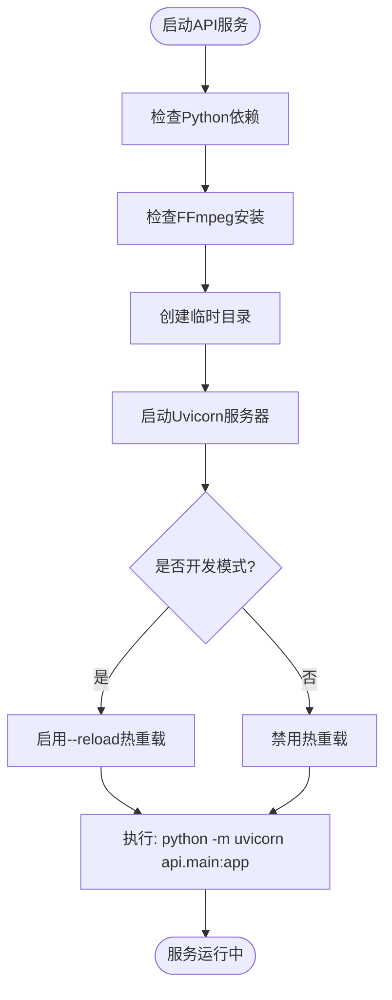
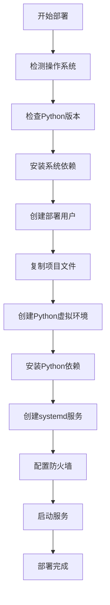
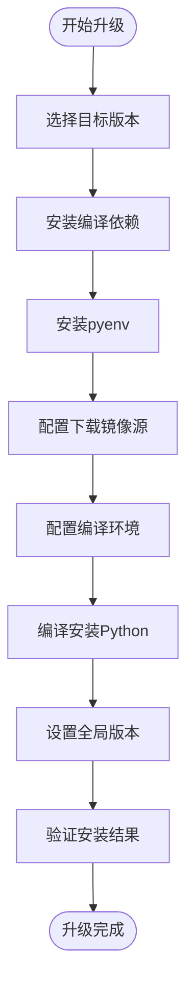
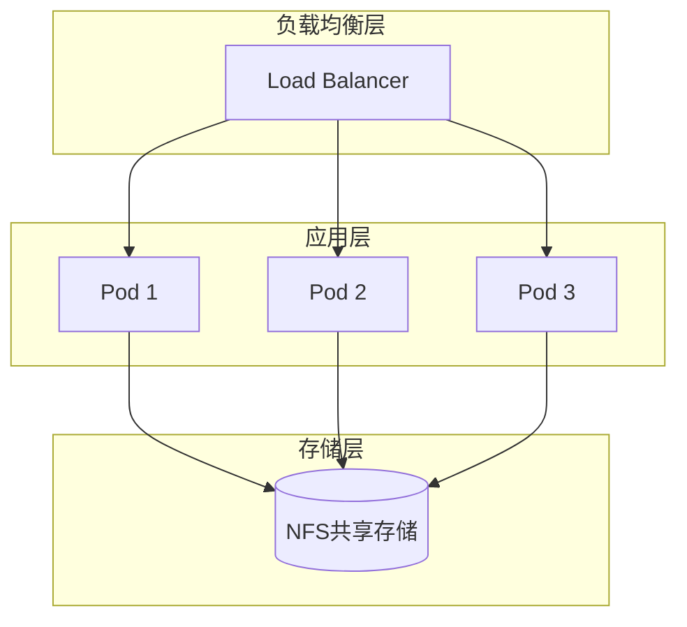

# 部署与运维

<cite>
**本文档引用文件**  
- [start.py](file://start.py)
- [deploy.sh](file://deploy.sh)
- [upgrade_python.sh](file://upgrade_python.sh)
- [requirements.txt](file://requirements.txt)
- [api/main.py](file://api/main.py)
</cite>

## 目录
1. [启动参数说明](#启动参数说明)  
2. [自动化部署流程](#自动化部署流程)  
3. [Python环境升级](#python环境升级)  
4. [系统资源要求](#系统资源要求)  
5. [日志与监控](#日志与监控)  
6. [高可用性部署](#高可用性部署)  
7. [Docker化建议](#docker化建议)

## 启动参数说明

`start.py` 脚本是视频下载API的核心启动入口，负责环境检查、依赖验证和服务器启动。该脚本通过环境变量和命令行参数控制服务行为。

### 核心启动参数

| 参数 | 环境变量 | 默认值 | 说明 |
|------|----------|--------|------|
| 主机地址 | `HOST` | `0.0.0.0` | 服务监听的网络接口，`0.0.0.0`表示允许所有IP访问 |
| 端口号 | `PORT` | `8000` | 服务监听的端口，可通过环境变量自定义 |
| 开发模式 | `--dev` | 无 | 启用热重载功能，代码修改后自动重启服务 |

**Section sources**  
- [start.py](file://start.py#L1-L115)

### 性能影响分析

- **`host` 参数**：设置为 `0.0.0.0` 可确保服务在云服务器上对外可访问，若设置为 `127.0.0.1` 则仅限本地访问，影响外部客户端连接。
- **`port` 参数**：端口选择需避免与系统其他服务冲突，高并发场景下建议使用非标准端口以减少安全扫描风险。
- **`--dev` 参数**：开发模式启用热重载会增加内存开销和文件监控开销，**生产环境必须禁用**，否则可能导致性能下降和安全风险。



**Diagram sources**  
- [start.py](file://start.py#L1-L115)

## 自动化部署流程

`deploy.sh` 脚本提供了一键式生产级部署能力，支持多种Linux发行版，自动化完成从环境准备到服务启动的全过程。

### 部署流程概览



**Diagram sources**  
- [deploy.sh](file://deploy.sh#L0-L364)

### 详细部署步骤

1. **操作系统检测**：脚本自动识别Ubuntu/Debian、CentOS/RHEL等系统，并选择对应的包管理器（apt/yum/dnf）。
2. **Python版本检查**：验证Python版本是否≥3.8，若不满足则提示用户运行`upgrade_python.sh`。
3. **系统依赖安装**：
   - 安装Python开发包、pip、venv
   - 安装Git、curl、wget等工具
   - 安装FFmpeg音视频处理工具
   - 安装编译工具链（build-essential）
4. **用户与权限管理**：
   - 创建专用部署用户 `apiuser`
   - 设置项目目录权限，遵循最小权限原则
5. **虚拟环境创建**：
   - 清理旧虚拟环境
   - 优先使用`python3 -m venv`创建
   - 失败时尝试`virtualenv`或自动安装
6. **Python依赖安装**：
   - 激活虚拟环境
   - 升级pip并安装`requirements.txt`中所有依赖
7. **systemd服务配置**：
   - 创建服务单元文件
   - 设置自动重启策略
   - 配置日志输出到journal
8. **防火墙配置**：
   - 检测并配置UFW或firewalld
   - 开放服务端口（默认8000）
9. **服务启动与验证**：
   - 启动systemd服务
   - 验证服务状态
   - 输出管理命令和访问地址

**Section sources**  
- [deploy.sh](file://deploy.sh#L0-L364)

## Python环境升级

`upgrade_python.sh` 脚本用于解决低版本Python（如3.6/3.7）不兼容的问题，提供跨平台的Python版本升级方案。

### 升级策略

| 操作系统 | 升级方案 | 特点 |
|---------|----------|------|
| Ubuntu/Debian | 使用deadsnakes PPA | 简单快速，包管理集成 |
| CentOS/RHEL | 使用pyenv | 灵活稳定，支持多版本共存 |
| CentOS 7 | 特殊编译处理 | 解决SSL和EOL问题 |

### 升级流程

1. **版本选择**：用户可选择预设版本（3.8-3.12）或自定义版本。
2. **编译依赖安装**：安装openssl-devel、libffi-devel等编译所需库。
3. **pyenv安装**：克隆pyenv仓库并配置环境变量。
4. **镜像源优化**：自动测试并选择最快的Python下载镜像源。
5. **编译环境配置**：
   - CentOS 7：配置特殊编译参数和SSL路径
   - 其他系统：启用优化编译
6. **Python编译安装**：使用pyenv编译指定版本的Python。
7. **全局版本设置**：将新版本设为系统默认。
8. **安装验证**：检查Python、pip、SSL模块是否正常。



**Diagram sources**  
- [upgrade_python.sh](file://upgrade_python.sh#L0-L395)

**Section sources**  
- [upgrade_python.sh](file://upgrade_python.sh#L0-L395)

## 系统资源要求

### 最低配置

| 资源 | 要求 | 说明 |
|------|------|------|
| CPU | 1核 | 处理视频下载和音频提取 |
| 内存 | 2GB | 运行Python服务和临时处理 |
| 磁盘空间 | 10GB | 存储临时文件和系统文件 |

### 推荐配置

| 资源 | 推荐 | 说明 |
|------|------|------|
| CPU | 2核及以上 | 提高并发处理能力 |
| 内存 | 4GB及以上 | 支持多任务并行处理 |
| 磁盘空间 | 50GB及以上 | 存储大量临时视频文件 |
| 网络带宽 | 10Mbps及以上 | 确保视频下载速度 |

### 资源监控建议

- **内存监控**：关注Python进程内存使用，避免OOM。
- **磁盘空间**：监控`temp/`目录大小，防止磁盘占满。
- **CPU使用率**：高并发时CPU可能成为瓶颈。

## 日志与监控

### 日志管理

- **日志位置**：通过systemd管理的服务，日志存储在系统journal中。
- **查看日志**：`journalctl -u video-download-api -f`
- **日志级别**：INFO级别记录关键操作，ERROR级别记录异常。

### 监控方案

1. **健康检查接口**：`GET /api/health` 返回服务状态。
2. **任务状态监控**：`GET /api/tasks` 获取所有任务统计信息。
3. **存储信息监控**：`GET /api/storage/info` 查看磁盘使用情况。
4. **外部监控集成**：可将健康检查接口接入Prometheus、Zabbix等监控系统。

**Section sources**  
- [api/main.py](file://api/main.py#L1-L630)

## 高可用性部署

### 进程管理器方案

使用 **Supervisor** 管理进程，提供：
- 进程自动重启
- 日志轮转
- 进程状态监控
- Web管理界面

### 容器编排方案

使用 **Kubernetes** 实现高可用部署：
- 多副本部署，避免单点故障
- 自动扩缩容（HPA）
- 服务发现与负载均衡
- 滚动更新与回滚

### 推荐部署架构



**Diagram sources**  
- [deploy.sh](file://deploy.sh#L0-L364)

## Docker化建议

尽管当前项目无Dockerfile，但可建议未来扩展Docker化部署。

### Dockerfile建议内容

```dockerfile
FROM python:3.11-slim

WORKDIR /app

COPY requirements.txt .
RUN pip install --no-cache-dir -r requirements.txt

COPY . .

RUN apt-get update && apt-get install -y ffmpeg && rm -rf /var/lib/apt/lists/*

EXPOSE 8000

CMD ["python", "start.py"]
```

### Docker Compose配置

```yaml
version: '3'
services:
  video-download-api:
    build: .
    ports:
      - "8000:8000"
    volumes:
      - ./temp:/app/temp
    restart: unless-stopped
```

### Docker化优势

- **环境一致性**：避免"在我机器上能运行"问题
- **快速部署**：一键启动，无需环境配置
- **资源隔离**：限制CPU、内存使用
- **易于扩展**：与Kubernetes无缝集成