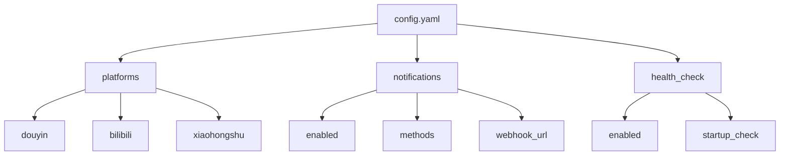
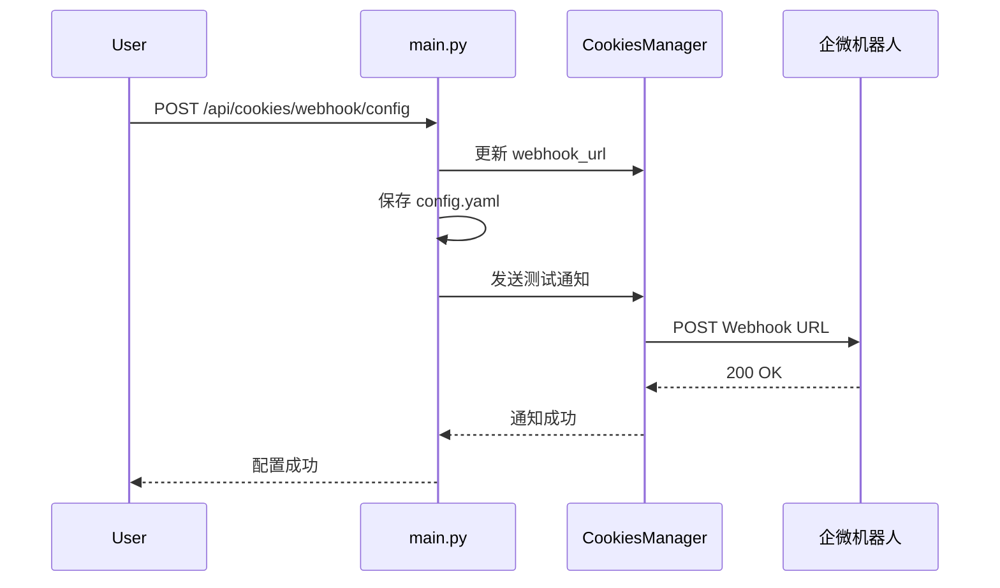
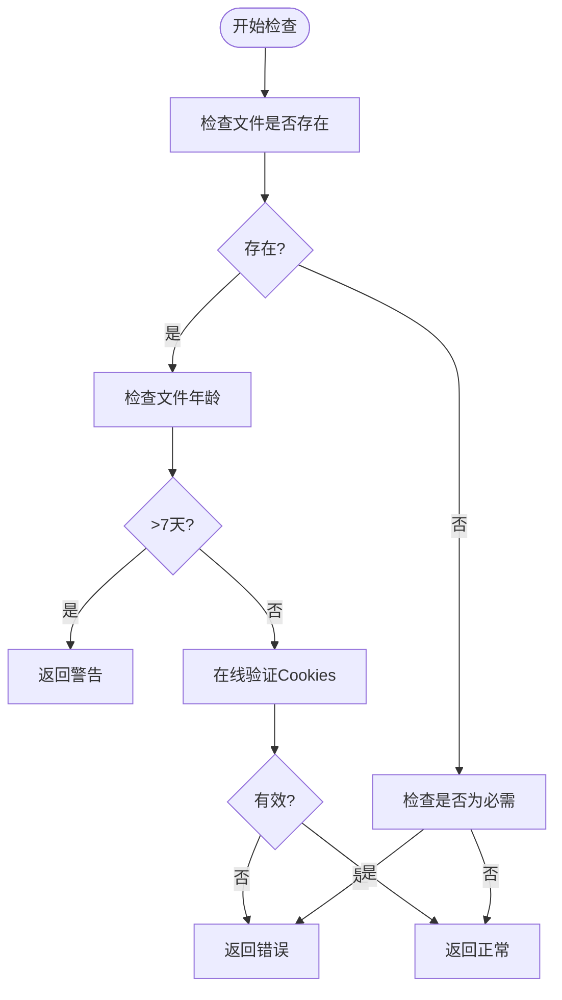

# 配置管理

<cite>
**本文档中引用的文件**
- [config.yaml](file://cookies/config.yaml)
- [COOKIES_GUIDE.md](file://cookies/COOKIES_GUIDE.md)
- [cookies_manager.py](file://api/cookies_manager.py)
- [main.py](file://api/main.py)
</cite>

## 目录
1. [配置文件结构](#配置文件结构)
2. [平台配置详解](#平台配置详解)
3. [Cookies文件格式与生成](#cookies文件格式与生成)
4. [通知系统配置](#通知系统配置)
5. [健康检查机制](#健康检查机制)
6. [常见配置错误与排查](#常见配置错误与排查)
7. [最佳实践建议](#最佳实践建议)

## 配置文件结构

`config.yaml` 是 `video-download-api` 的核心配置文件，位于 `cookies/` 目录下，采用 YAML 格式组织，主要分为三个逻辑部分：平台配置、通知配置和健康检查配置。



**Diagram sources**
- [config.yaml](file://cookies/config.yaml#L1-L46)

**Section sources**
- [config.yaml](file://cookies/config.yaml#L1-L46)

## 平台配置详解

平台配置定义了支持的视频平台及其对应的 Cookies 文件设置。每个平台在 `platforms` 字段下作为一个独立的子项。

### 配置字段说明

| 字段 | 类型 | 必需 | 说明 |
| :--- | :--- | :--- | :--- |
| `name` | 字符串 | 是 | 平台的中文名称，用于日志和状态报告 |
| `cookies_file` | 字符串 | 是 | 指定该平台 Cookies 的文件名（相对于 `cookies/` 目录） |
| `required` | 布尔值 | 是 | 标记该平台是否必需。若为 `true` 且文件缺失，将产生错误 |
| `check_interval` | 整数 | 是 | 健康检查的间隔时间（秒） |
| `expiry_warning_days` | 整数 | 是 | 在 Cookies 文件过期前多少天开始提醒 |

### 支持的平台

当前配置支持以下三个平台：

- **抖音 (douyin)**: `cookies_file: "douyin.txt"`，`required: true`。这是唯一必需的平台，下载抖音视频必须提供有效的 Cookies。
- **哔哩哔哩 (bilibili)**: `cookies_file: "bilibili.txt"`，`required: false`。用于访问会员或付费内容，为可选配置。
- **小红书 (xiaohongshu)**: `cookies_file: "xiaohongshu.txt"`，`required: false`。用于访问受限内容，为可选配置。

### 添加新平台

要添加对新平台（如 `weibo`）的支持，只需在 `platforms` 下添加相应的配置块：
```yaml
  weibo:
    name: "微博"
    cookies_file: "weibo.txt"
    required: false
    check_interval: 3600
    expiry_warning_days: 5
```
系统会自动识别并管理该平台的 Cookies。

**Section sources**
- [config.yaml](file://cookies/config.yaml#L4-L36)
- [cookies_manager.py](file://api/cookies_manager.py#L82-L95)
- [cookies_manager.py](file://api/cookies_manager.py#L108-L127)

## Cookies文件格式与生成

正确生成和格式化 Cookies 文件是确保 API 正常工作的关键。系统支持多种输入格式，并会自动转换为 `yt-dlp` 所需的 Netscape 格式。

### 支持的输入格式

根据 `COOKIES_GUIDE.md` 的指导，推荐使用以下两种格式：

1.  **完整 Cookie 字符串 (推荐)**：直接从浏览器开发者工具的 `Network` -> `Headers` -> `Cookie` 字段中复制完整的字符串。
    ```
    sessionid=abc123; csrf_token=def456; uid_tt=789
    ```
2.  **一行一个**：每个 Cookie 单独占一行。
    ```
    sessionid=abc123
    csrf_token=def456
    ```

### 生成步骤

1.  **登录平台**：在浏览器中登录目标平台（如抖音、B站）并确保可以正常浏览。
2.  **打开开发者工具**：按 `F12`，切换到 `Application` 或 `Network` 标签页。
3.  **获取 Cookie**：
    *   **方法一 (推荐)**：在 `Network` 标签页刷新页面，点击任意请求，在 `Headers` 的 `Request Headers` 区域找到 `Cookie`，复制其完整值。
    *   **方法二**：在 `Application` -> `Storage` -> `Cookies` 中，找到对应域名，手动复制所有关键字段。
4.  **保存文件**：将获取的 Cookie 内容粘贴到 `cookies/` 目录下的对应文件中（如 `douyin.txt`）。

### 自动转换机制

`CookiesManager` 类中的 `_process_cookies_file` 方法负责处理文件格式转换。它会：
1.  检测输入文件的格式。
2.  如果是原始字符串格式，则调用 `_parse_cookies_string` 进行解析。
3.  根据平台（通过 `_detect_platform_from_path` 识别）确定域名。
4.  将解析后的键值对写入一个以 `.netscape.txt` 为后缀的临时文件，并遵循 Netscape Cookie 文件格式。

**Section sources**
- [COOKIES_GUIDE.md](file://cookies/COOKIES_GUIDE.md#L0-L106)
- [cookies_manager.py](file://api/cookies_manager.py#L169-L220)
- [cookies_manager.py](file://api/cookies_manager.py#L234-L274)
- [cookies_manager.py](file://api/cookies_manager.py#L222-L232)

## 通知系统配置

通知系统用于在 Cookies 出现问题时（如文件缺失、过期）向用户发出警报。

### 配置字段

| 字段 | 说明 |
| :--- | :--- |
| `enabled` | 是否启用通知系统 |
| `methods` | 通知方式列表，支持 `log`（日志）、`file`（文件）、`webhook`（企微机器人） |
| `log_level` | 日志记录级别 |
| `notification_file` | 记录通知的文件名 |
| `webhook_url` | 企微机器人的 Webhook URL |

### Webhook 配置

要启用企微机器人通知，需将 `webhook_url` 字段设置为从企业微信获取的 URL。系统通过 `main.py` 中的 `/api/cookies/webhook/config` API 端点来更新此配置，并将其持久化到 `config.yaml` 文件中。



**Diagram sources**
- [config.yaml](file://cookies/config.yaml#L38-L46)
- [main.py](file://api/main.py#L475-L512)
- [cookies_manager.py](file://api/cookies_manager.py#L74-L80)

**Section sources**
- [config.yaml](file://cookies/config.yaml#L38-L46)
- [main.py](file://api/main.py#L475-L512)
- [cookies_manager.py](file://api/cookies_manager.py#L376-L404)
- [cookies_manager.py](file://api/cookies_manager.py#L406-L442)

## 健康检查机制

系统内置了自动化的健康检查机制，确保 Cookies 的有效性。

### 检查类型

| 检查类型 | 配置项 | 触发时机 |
| :--- | :--- | :--- |
| 启动检查 | `startup_check` | 服务启动时 |
| 定期检查 | `periodic_check` | 按 `check_interval` 定时执行 |
| 错误时检查 | `check_on_error` | 下载任务出错时 |

### 检查逻辑

`check_cookies_validity` 方法执行以下检查：
1.  **文件存在性**：检查指定的 Cookies 文件是否存在。
2.  **文件时效性**：检查文件的修改时间，若超过 7 天（168小时），则标记为可能过期。
3.  **在线验证**：对于 B站和小红书，使用 `yt-dlp` 库进行在线验证，测试 Cookies 是否有效。

检查结果会通过 `get_status_report` 方法生成一份清晰的状态报告，并可通过 `/api/cookies/status` API 接口获取。



**Diagram sources**
- [config.yaml](file://cookies/config.yaml#L48-L50)
- [cookies_manager.py](file://api/cookies_manager.py#L129-L167)
- [cookies_manager.py](file://api/cookies_manager.py#L276-L334)

**Section sources**
- [config.yaml](file://cookies/config.yaml#L48-L50)
- [cookies_manager.py](file://api/cookies_manager.py#L129-L167)
- [cookies_manager.py](file://api/cookies_manager.py#L336-L358)
- [cookies_manager.py](file://api/cookies_manager.py#L444-L473)

## 常见配置错误与排查

### 常见错误

1.  **路径错误**：`cookies_file` 指定的文件名与 `cookies/` 目录下的实际文件名不匹配。
2.  **格式不匹配**：Cookies 文件内容为空或格式严重错误，导致无法解析。
3.  **文件缺失**：对于必需平台（如抖音），`douyin.txt` 文件不存在。
4.  **Cookies 过期**：文件存在但内容已过期，导致下载失败。

### 排查方法

1.  **检查文件路径和名称**：确认 `config.yaml` 中的 `cookies_file` 与 `cookies/` 目录下的文件完全一致。
2.  **验证文件内容**：打开 `.txt` 文件，确保包含有效的 Cookie 键值对。
3.  **查看日志**：检查 `cookies_notifications.log` 和服务日志，寻找 `缺少必需的cookies文件` 或 `cookies无效或过期` 等错误信息。
4.  **使用API接口**：访问 `/api/cookies/status` 接口，获取详细的 Cookies 状态报告。

**Section sources**
- [COOKIES_GUIDE.md](file://cookies/COOKIES_GUIDE.md#L108-L142)
- [cookies_manager.py](file://api/cookies_manager.py#L360-L374)

## 最佳实践建议

1.  **定期更新 Cookies**：由于 Cookies 会过期，建议定期（如每周）重新获取并更新文件，以保证服务的稳定性。
2.  **使用独立账号**：避免使用个人主账号，建议为 API 创建专用的、权限较低的账号，以降低主账号被封禁的风险。
3.  **优先使用完整字符串**：从 `Network` 标签页复制完整的 Cookie 字符串，能最大程度保证包含所有必要字段。
4.  **妥善保管文件**：Cookies 文件包含敏感信息，应设置适当的文件权限（如 `600`），避免在公共场合或不安全的网络环境下操作。
5.  **启用通知**：配置企微机器人 Webhook，以便在出现问题时能第一时间收到通知，快速响应。