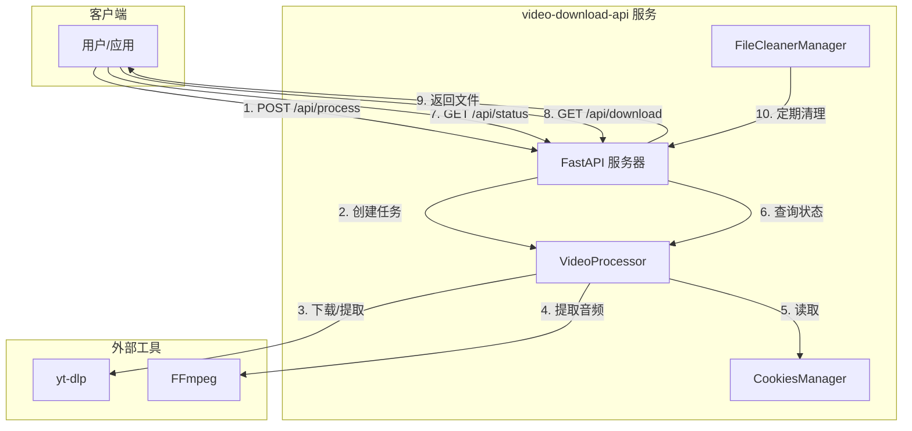

# 项目概述

<cite>
**本文档引用的文件**
- [README.md](file://README.md)
- [api/main.py](file://api/main.py)
- [api/video_processor.py](file://api/video_processor.py)
- [api/cookies_manager.py](file://api/cookies_manager.py)
- [api/file_cleaner.py](file://api/file_cleaner.py)
- [start.py](file://start.py)
- [requirements.txt](file://requirements.txt)
</cite>

## 目录
1. [项目简介](#项目简介)
2. [架构风格](#架构风格)
3. [核心特性](#核心特性)
4. [系统上下文图](#系统上下文图)
5. [主要使用场景](#主要使用场景)
6. [技术价值与生态定位](#技术价值与生态定位)
7. [扩展潜力](#扩展潜力)

## 项目简介

`video-download-api` 是一个基于 FastAPI 构建的现代化视频下载与音频提取 API 服务。该项目旨在为开发者提供一个简单、高效且可靠的解决方案，用于从抖音、B站、小红书、YouTube、TikTok 等超过30个主流社交媒体和视频平台下载视频内容或提取高质量音频。

项目的核心目标是将复杂的视频处理流程（包括网络请求、反爬虫规避、格式转换、文件管理等）封装成一个简洁的 RESTful API 接口，使开发者无需深入了解底层技术细节，即可在自己的应用中集成强大的媒体处理能力。无论是用于社交媒体内容归档、创建音频提取工具，还是构建自动化媒体处理管道，该项目都提供了坚实的基础。

其设计哲学强调**易用性**、**健壮性**和**可维护性**。通过提供清晰的 API 文档、详细的部署脚本和全面的错误处理机制，项目降低了用户的使用门槛。同时，它利用 `yt-dlp` 这一强大的开源工具作为核心引擎，确保了对多平台的广泛支持和持续更新。

**Section sources**
- [README.md](file://README.md#L1-L370)
- [api/main.py](file://api/main.py#L1-L630)

## 架构风格

该项目采用典型的**RESTful API 后端服务**架构，遵循现代 Web 服务的设计原则。

*   **API 层**: 以 **FastAPI** 为核心框架，负责处理所有 HTTP 请求。它提供了清晰的路由（如 `/api/process`, `/api/status/{task_id}`, `/api/download/{filename}`），并利用 Pydantic 模型进行请求和响应的数据验证与序列化，确保了接口的健壮性和类型安全。
*   **业务逻辑层**: 由 `api/video_processor.py` 中的 `VideoProcessor` 类实现。这一层是项目的核心，它不直接处理 HTTP 请求，而是专注于视频和音频的处理逻辑。它通过配置化的 `yt-dlp` 选项，实现了对不同平台的智能适配和优化下载。
*   **辅助服务层**: 包含两个关键的后台服务：
    *   **Cookies 管理器** (`api/cookies_manager.py`): 为需要登录状态的平台（如B站、小红书）管理认证信息，支持自动检测和通知。
    *   **文件清理管理器** (`api/file_cleaner.py`): 在后台定期运行，根据预设策略（如文件保留时间、最大存储空间）自动清理临时目录中的过期文件，防止磁盘空间被耗尽。
*   **外部依赖**: 项目依赖于两个关键的外部工具：
    *   **yt-dlp**: 作为视频下载和信息提取的“引擎”，负责与各个视频平台的 API 交互。
    *   **FFmpeg**: 作为音频提取的“后备方案”，当 `yt-dlp` 无法直接获取音频流时，用于从下载的视频文件中提取 MP3 音频。

这种分层架构将网络通信、业务逻辑和系统维护职责清晰地分离，使得代码结构清晰，易于理解和维护。

**Section sources**
- [api/main.py](file://api/main.py#L1-L630)
- [api/video_processor.py](file://api/video_processor.py#L10-L502)
- [api/cookies_manager.py](file://api/cookies_manager.py#L19-L488)
- [api/file_cleaner.py](file://api/file_cleaner.py#L15-L197)

## 核心特性

`video-download-api` 提供了一系列精心设计的核心特性，使其在同类工具中脱颖而出。

*   **异步处理**: API 的 `/api/process` 端点是异步的。当用户提交一个视频处理任务时，服务会立即返回一个唯一的 `task_id`，而实际的下载和处理工作在后台线程中进行。这避免了长时间的 HTTP 请求超时，提升了用户体验和服务器的并发处理能力。
*   **任务状态查询**: 通过 `/api/status/{task_id}` 接口，客户端可以随时轮询任务的处理进度。返回的 JSON 数据包含了 `status`（processing, completed, error）、`progress`（百分比）、`message`（状态描述）以及最终的文件下载链接，实现了对处理过程的完全掌控。
*   **智能音频提取与自动文件清理**: 项目采用了“优先直接提取，失败则回退”的智能策略。它首先尝试使用 `yt-dlp` 直接提取音频流，以获得最快的速度。如果失败，则会下载视频文件，并立即使用 `FFmpeg` 从中提取音频。**关键的是**，当用户仅请求音频时（`keep_video=false`），系统会在提取完成后自动删除原始的视频文件，有效节省了存储空间。
*   **多平台兼容性**: 通过 `yt-dlp` 的强大支持，项目可以处理超过30个平台。代码中还针对抖音、B站等特定平台实现了 URL 解析和请求头优化，提高了下载成功率。
*   **安全性与健壮性**: 项目在多个层面考虑了安全性。例如，`/api/download` 接口会检查文件名，防止路径遍历攻击。同时，代码中包含了大量的异常处理和日志记录，便于问题排查。

**Section sources**
- [api/main.py](file://api/main.py#L1-L630)
- [api/video_processor.py](file://api/video_processor.py#L192-L343)
- [api/file_cleaner.py](file://api/file_cleaner.py#L69-L96)

## 系统上下文图

下图展示了 `video-download-api` 服务与外部组件之间的交互关系。

**Diagram sources**
- [api/main.py](file://api/main.py#L1-L630)
- [api/video_processor.py](file://api/video_processor.py#L10-L502)
- [api/cookies_manager.py](file://api/cookies_manager.py#L19-L488)
- [api/file_cleaner.py](file://api/file_cleaner.py#L15-L197)

## 主要使用场景

该项目适用于多种自动化和集成场景：

*   **社交媒体内容归档**: 个人或企业用户可以使用此 API 自动下载自己或他人的视频内容，用于备份、分析或创建离线收藏。
*   **音频提取工具集成**: 开发者可以基于此 API 构建一个简单的网页或桌面应用，允许用户粘贴视频链接，一键获取 MP3 音频文件，用于制作播客、音乐收藏等。
*   **自动化媒体处理管道**: 在更复杂的系统中，此 API 可以作为数据采集环节。例如，一个内容分析平台可以调用此 API 下载视频，然后将音频文件传递给语音识别服务，将视频文件传递给计算机视觉模型，实现端到端的自动化处理。
*   **云服务集成**: 由于其轻量级和云服务器友好的特性，可以轻松部署在云服务器上，作为 SaaS 服务的一部分，为其他应用提供媒体处理能力。

## 技术价值与生态定位

`video-download-api` 在开发者生态中扮演着**基础设施组件**的角色。它的技术价值体现在：

1.  **降低技术门槛**: 它将 `yt-dlp` 和 `FFmpeg` 这些功能强大但命令行操作复杂的工具，封装成了易于集成的 HTTP API，使得不具备音视频处理专业知识的开发者也能轻松使用。
2.  **提高开发效率**: 开发者无需从零开始研究各个视频平台的 API 和反爬虫机制，可以直接利用该项目的成熟解决方案，将精力集中在自己的核心业务逻辑上。
3.  **促进自动化**: 通过提供标准化的 API 接口，它促进了工作流的自动化，是构建“无代码”或“低代码”自动化工具的理想后端。

它填补了从“命令行工具”到“可集成服务”之间的空白，是连接复杂底层技术与上层应用的桥梁。

## 扩展潜力

对于高级用户，该项目提供了丰富的扩展可能性：

*   **功能扩展**: 可以轻松添加新的功能，如支持字幕下载、视频转码（调整分辨率、格式）、批量处理等。
*   **平台扩展**: 由于依赖 `yt-dlp`，只要 `yt-dlp` 支持新的平台，本项目几乎无需修改即可获得支持。
*   **部署扩展**: 可以将服务容器化（Docker），并结合消息队列（如 Redis Queue）和分布式任务队列（如 Celery），构建一个高可用、可水平扩展的微服务架构，以处理海量的并发请求。
*   **监控与告警**: 可以集成更完善的监控系统，对服务的健康状况、任务处理时间、磁盘使用率等进行实时监控，并通过 Webhook 发送告警。

**Section sources**
- [README.md](file://README.md#L1-L370)
- [api/main.py](file://api/main.py#L1-L630)
- [api/video_processor.py](file://api/video_processor.py#L10-L502)